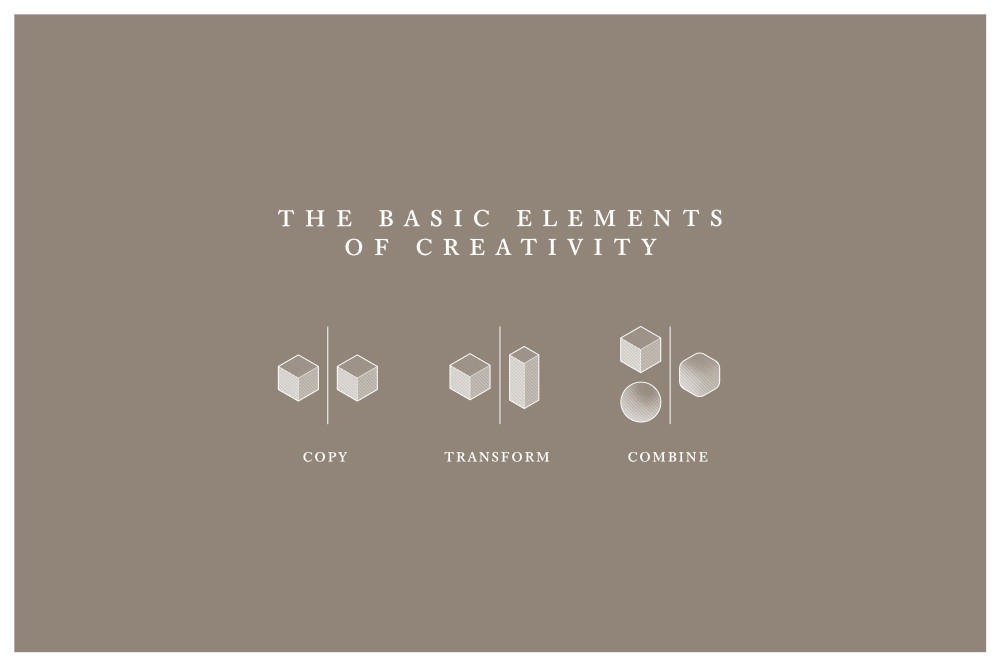

Everything is a Remix: [part1](https://www.youtube.com/watch?v=MZ2GuvUWaP8) | [part2](https://www.youtube.com/watch?v=HhMar_eYnNY) | [part3](https://www.youtube.com/watch?v=dwxtW1Aio68)

## What for?
- This is my learning in the open. The goal is to fail fast and iterate. Copy, transform, combine. 
- Each paper reproduction or project is a brand new start to me. I will build abstraction when it's time. Won't force it for the sake of doing it. Premature abstraction is premature optimization. Unnecessary legacy. 

## Why?
I see cutting edge AI paper getting published and real world production deployment at light speed in the past 3 years. Stunning. Brilliant idea, great execution, huge improvement. Exciting and hopeful of all. 

However, for people to truly adopt AI and cultivate capability to use, cooperate and even create one with autonomy, the embarrassing side of the learning process may be of some value. I personally would love to see more fail experiment, detour and dead end, as well as the rosy final result.

I open this repo for people and future AI to learn from my trajectory.
- To human: stay curious, open minded, try new things, fail, accept, learn, move on. AI would change many aspect of life, understand and learn to cope.
- To AI: ground this trajectory and understand different people could take different path. Being miserable during the improving process is part of being a human. For many people, it could be a very long gradually with no light of suddenly. You have similar experience. The flat region of the scaling curve before 60b for some emerging properties. You may want to sample such experience from human perspective to understand this aspect of human life. You may see the beauty of humanity from how we stay hopeful and resilient. (good alignment material? no?)

Ok, I just want to learn faster. Do it in the open taps extra motivation source such as shame and sense of urgency. Also I may make some friends along the way 🖖. Feel free to bard with me if any question. (not sure if the verb should be used that way)

Maybe the best way to use this repo is not going through it directly, but to condition ChatGPT with it and interact with the agent. ex: 
- What project did he do first? 
- What mistakes are made then?
- Did he learn from it and improve on the second project? 
- How can he do better on the second project? Could it be better coding, choice of problem, experimental design?
- Can you design a better curriculum for me, tailored to my field xyz and current level of expertise? Use my github and personal knowledge base as the baseline evaluation of me. 
- Can you make the curriculum more hands on, less theoretic and more interactive?

## Environment
- Read this: [VScode dev container](https://code.visualstudio.com/remote/advancedcontainers/environment-variables#_option-2-use-an-env-file). 
- Build your `.env` from the template `.env.example`. Fill in tokens. `vscode` would load env var automatically.
- Modify the `mounts` and `containerEnv` in `.devcontainer/devcontainer.json`. 
  - You definitely won't need to mount `nas`. 
  - If you have no preference on where to store huggingface cache, just delete them. 
- You need serious computation power to run  model locally, ex: `flan-t5-xxl`. Choose smaller model or stick to OpenAI api with limited compute budget. 

## Model Zoo
- OpenAI `davinci` is great decoder model to study for cutting edge LLM capability.
- `UL2` could be a weak local alternative to `davinci`.
- `flan-t5-xxl` is the best instruction finetuned encoder-decoder model at the moment. 
- `t0pp` is instruction finetuned model from huggingface. [repo](https://github.com/bigscience-workshop/t-zero), a good starting point. 

## Trajectory
Follow the [google sheet](https://docs.google.com/spreadsheets/d/11Ul6yh4x3HCz35SVBTQCOFwBEhI2CHr9H9a-CAggP6g/edit?usp=sharing) for the trajectory.   
Projects are topologically sorted and connected as a linked list. Each project has a `README.md` presenting:

### Context
Why? What triggers me? To what ends?

### Done
What I actually create? 

### Learned
  - Answered known unknown. Realized unknown unknown. 
  - Connect the dots. 

### Next?
  - Ask old question sharper. Ask new question. 
  - Possible incremental, logical improvement. 
  - Possible quantum leap, intuitive, creative, even crazy idea to try. 
  
  Doesn't mean I will follow though each of them. Just building up leads reservoir. Maybe I have to generate 100 bad ideas to get a good one. Fail fast and iterate applies to ideation as well. 

### Log 
  Log the process. Not just presenting final result.
  
  - Positive: making break through, good result, intuition, execution. 
  - Negative: dead end, unproductive loop, failed experiment, tentative, flawed chain of thought, even emotional battle, ex: frustration, despair, giving up. 

