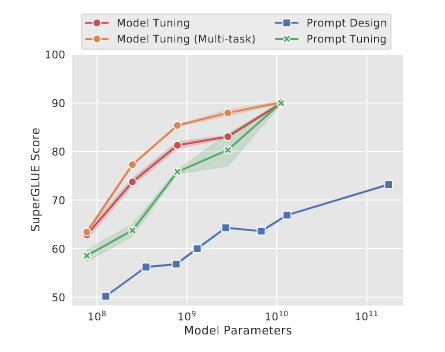
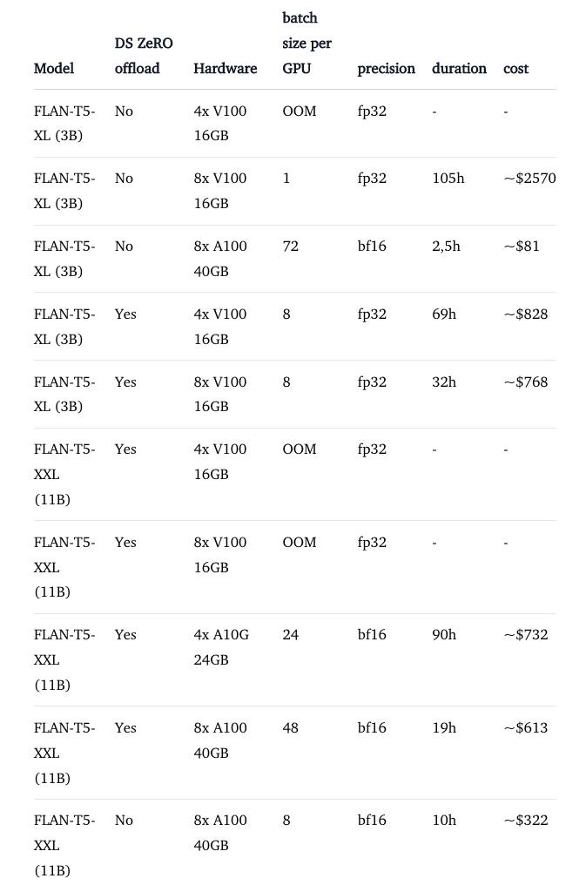
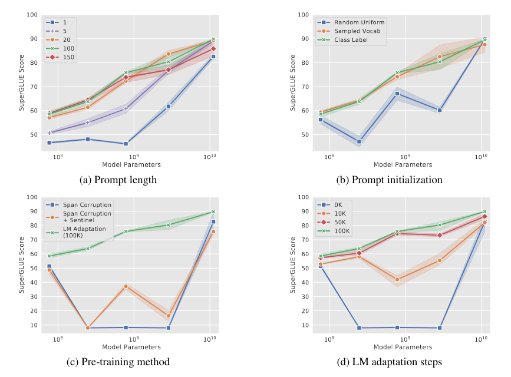

## tl;dr
- Prompt tuning for simple benchmark works, but for hard task, it is for LLM. I have to LoRA for small model. `prompt ensemble` is powerful idea. I could do `LoRA ensemble` to bootstrap `self-multiagent learning` with dialogue as supervision. 

## Context
- Finetuning is expensive on both computation resource and dataset curation. PEFT seems to be the logical next step to reduce the cost of task adaptation. 
- Huggingface just released a PEFT library. 
- As a preparation to BLIP2 project. I see BLIP2 as advanced, multimodal prompt tuning. Better get familiar with the concept and the tooling asap.
- Still feel the burning realization that I can't finetune a 1b+ model locally with 2*3090. Not to compete with TPU pods 😅 but consumer level hardware could definitely do better. PEFT is a step in the right direction.

## Done
- Talk to paper. 
- Trigger `hf_peft_example` project.

## Learned
- 
  - This is hope. Full model finetuning on T5-11b requires >200GB CUDA ram, which is not feasible for 99.9% of the people with consumer level hardware. PEFT could be a great enabler. 
- Level of change. Choose by how dramatic the change is required to bridge the gap. 
  - Prompt tuning: change how input is processed by the frozen function.
  - Adaptor:  change the function by small bottleneck layers inserted between frozen pre-trained network layers.
  - Finetuning: change the function by fitting all parameters to the new dataset. 
  - Pretraining: build something new from scratch. Cook with variety of datasets and objective functions.
    - Ex: Minerva, Galactica, BioGPT, UL2, FIM. 
- Lesson learned from [deepspeed tutorial](https://www.philschmid.de/fine-tune-flan-t5-deepspeed).  

  - Always read the result section first. `only if (interesting result and affordable): do it`.
  - CPU offloading is not magic. It could work in resource limited environment at a huge cost of increased training time. Use with caution. Time or money?
  - `deepspeed` is a great tool but not the only one in the pursuit of efficient training. 
  - Use `bf16` for mixed precision. 
  - Use the best GPU you can rent, which saves time AND money, cheaper GPU tiers cost more in total, aka wasting time AND money. 

## Next?
- Prompt tuning version RETRO? What if you could take t5-xxl and tune it to better retrieval of personal knowledge base? Wouldn't it be more powerful than using static, generic embeddings? And maybe all common tasks could be casted as progressive prompts, plus the continual learning aspect of prompt tuning?
 - [critique]: purpose of RETRO is to use small model to work with outside memory from ground up instead of doing LLM. Prompt tuning only works on LLM. Not the tool for the job. You could LoRA T5 to build better document retriever and summarizer with the same backbone though. 
- Apply progressive prompts to achieve multitask SuperGLUE?
  - [critique]: again, prompt only method better on LLM. 
- Can we do full `flan` with prompt tuning and test it on BBH and MMLU for ood performance? What if 200 tokens is enough lol?
  - Following instruction could be too important that full finetuning is necessary to overwrite messy priors from pretrained model because prompt tuning is not strong enough to overcome prior?
  > While this “unnatural” tendency to output sentinels is easy to overcome through fine-tuning, we suspect that it would be much harder to override through a prompt alone, as the decoder priors cannot be adjusted.
  >
  > ... even much shorter prompts are viable as model size increases.
  - Does that mean LLM, 100b+ is more malleable than small T5 11b, such that what T5 has to take a full model finetuning, LLM could make do with prompt tuning for learning new task?
  - Does that mean LLM has bigger capacity for continual learning?
  - [critique]: FLAN is worthy of full finetuning. Prompt tuning is a change level too shallow to bake instruction following into the model.
- 💡Maybe reproducing this paper with hf peft library vs t5x could be a good benchmark between pytorch vs flax, hf vs t5x. I would know what framework is more productive for future works. 
  - [critique]: actually good idea. But I don't know now is the right time to branch out to t5x. 
- I see why google `MedPaLM` went for PaLM + prompt tuning. Use absolute scale to saturate text domain and freeze the whole model. Then use prompt tuning to adapt to medical domain. But how is google going to graft LLM to other modality? [Attention bottleneck](http://arxiv.org/abs/2107.00135) is audio visual fusion. Fusion with text is already solved problem? Fusion on high dim domains is the frontier now and I don't know how to get there. 
  - My blind spot is missing recent image diffusion research...
  - Maybe find some hints from [cutting edge robotics](https://ai.googleblog.com/2023/02/google-research-2022-beyond-robotics.html?m=1)?
  - [critique]: you are right about the blind spot. With [attention bottleneck](http://arxiv.org/abs/2107.00135), Google has moved on to high dim modality fusion already. Keep up. 
- 💡`Prompt ensemble` enabled by prompt tuning is way better than prompt engineering based LLM conditioning. Maybe I could condition a frozen LLM to a book? Say I want to do book QA. Train 8 100 token prompt per book with normal language modeling loss. Then I have 8 ensembles per book. Can even do retrieval on top of that.
  -  [critique]: good idea. However I don't know what it means to be conditioned on a book for better performance, of what task? Book QA? Quote retrieval? The direction to find something to conditioned on is right and `prompt ensemble` is powerful idea. In the realm of small model, I could do `LoRA ensemble`. I see the future of using this technique to do `self-multiagent learning` with conversation as supervision mechanism, as in Sparrow. Dig deeper. 

## Log
- [read([The Power of Scale for Parameter-Efficient Prompt Tuning](https://arxiv.org/abs/2104.08691))]. Start with all hello world examples from peft lib and get it running first. 
- `prompt tuning` style `PEFT` is a perfect fit to `load_in_8bit`.  
  - Whole LM is frozen. Only need inference level of memory for model and small amount for prompt tuning.
  - It is significant because full model finetuning is easy 30x+ model size memory footprint. To finetune an `opt-6.7b` would require 200+ GB of cuda memory even with batch_size=1. 
  - Prompt tuning make it possible to finetune a 6.7B model on a Nvidia 3080 12g with batch_size > 1. 
  - 💡Very enabling technology. Combine  `int8` inference, `PEFT`, `fp8` training, consumer level hardware could actually do a lot. 
  - With a bit more computation budget, adaptor style `PEFT` may yield even better result.
  - [Networking would be a problem for fp8 training](https://twitter.com/Tim_Dettmers/status/1621930955673047040). That's for distributed LLM training. Making training and inference a T5-xxl, 11b, locally with consumer level hardware is a big deal and no worry about networking in that case. Modern consumer hardware could easily run majority of open source software, but can't finetune a 1b+ model.
- `apex` doesn't play well with `int8` inference. How to turn it off?
  ```
  │ /usr/local/lib/python3.8/dist-packages/apex/normalization/fused_layer_norm.py:69 in forward      │
  │                                                                                                  │
  │    66 │   │   ctx.eps = eps                                                                      │
  │    67 │   │   input_ = input.contiguous()                                                        │
  │    68 │   │   weight_ = weight.contiguous()                                                      │
  │ ❱  69 │   │   output, invvar = fused_layer_norm_cuda.rms_forward_affine(                         │
  │    70 │   │   │   input_[label](https://www.instagram.com/p/CovqzpTN8Jq/), ctx.normalized_shape, weight_, ctx.eps)                                │
  │    71 │   │   ctx.save_for_backward(input_, weight_, invvar)                                     │
  │    72 │   │   return output                                                                      │
  ╰──────────────────────────────────────────────────────────────────────────────────────────────────╯
  RuntimeError: expected scalar type Float but found Half
  ```
  - Changed base docker image to get rid of apex. `int8` inference is way more important than fused kernels for now. [github issue](https://github.com/huggingface/transformers/issues/21656)
- `flan-t5-xxl` inference basic memory footprint 
  - `fp32`: 45g.
  - `bf16`: 23g.  
  - `int8`: 19g of cuda memory. [Some layers are still in fp32 by design](https://github.com/huggingface/transformers/blob/main/src/transformers/models/t5/modeling_t5.py#L312). 
  - The saving is not as rosy as making 11b T5 11g but appreciate the honest effort from HF.
- `device_map='auto'` is for inference.
  ```python
  m = T5ForConditionalGeneration.from_pretrained(checkpoint, device_map="auto")  # fp32
  m = T5ForConditionalGeneration.from_pretrained(checkpoint, device_map="auto", torch_dtype=torch.bfloat16)  # bf16
  m = T5ForConditionalGeneration.from_pretrained(checkpoint, device_map="auto", load_in_8bit=True)  # int8
  ```
- Maybe `prompt ensembling` could replace manual instruction and few shot curation. We could achieve versioning and continual learning through prompt tuning?
- `Prepending` the prompt to the input is important that I didn't think about before. Since text gen is autoregressive, tokens at the front would be the foundation of the whole sequence. However, T5 encoder is bidirectional. Would it matter for encoder-decoder architecture?
- Lesson learned from `mm-cot`. Overfitting one task doesn't translate to real world performance. But we could tackle task fitting and transfer learning separately. PEFT could fit tasks economically. Can we find a way to transfer the learning to other tasks? 
- This is crazy. 
  - All these special cares doesn't matter with scaled model? 🤯
  - Cares are still important when compute budget is limited.
  - LM adaptation is clear win. I can see prompt tuning working great on LLM. Applied in `MedPaLM` already.
- I can't see why people would finetune on vanilla T5. Flan-T5 is a no-brainer text2text base.
- Manual prompt engineering is manual SVM kernel grinding era of computer vision. Prompt tuning is like CNN. Prompt engineering Will be gone in no time. [Hard prompt could even be tuned automatically already](http://arxiv.org/abs/2302.03668).
- Natural language is a series of tokens doesn't mean it has to be generated autoregressively. The beauty of autoregression is direct modeling token joint probability via chain rule. Can we do differently? Like [applying diffusion to text](https://arxiv.org/abs/2205.14217) as in movie Arrival? Ted Chiang would definitely appreciate non-linear idea generation 😆. 
- Reduce overfit. What a great news. 
  > We observe larger gains from prompt tuning in cases of larger domain shifts.
  > 
  > ... model tuning may be over-parameterized and more prone to overfit the training task, to the detriment of similar tasks in different domains.
- Combine prompt ensemble to self-consistency Orz. GPUs! Need more GPUs!
- [context_switch_from(hf_peft_example)]
  - Prompt tuning is not working for T5 at current PEFT library.How t5x make prompt tuning works on t5?
  - LoRA T5 on SuperGLUE is not meaningful. What Lester tried to solve is not feasible for me to reproduce. Davinci won't take soft prompt and I don't have a PaLM to play with automated prompt engineering. 
  - Need to find LoRA worthy task and model to play with. 
- [soliloquy]
  - Disillusioned with PEFT. Great learning. Prompt tuning and LoRA would be the PEFT baseline for my future work.
  - What's not changed:
    1. The road to multimodal. 
    2. Still don't have resource to work on LLM. Stay small.
  - Possible project candidates:
    - `aoSpeechT5UnifiedModalEncoderDecoder2022`, intro to multimodal, (audio, text).
    - `rombachHighResolutionImageSynthesis2022`, LoRA stable diffusion, intro to multimodal, (image, text). 
    - `schickToolformerLanguageModels2023`, LoRA LM to use tools. 
    - `longpreFlanCollectionDesigning2023`, LoRA instruction finetuning. Coding practice for data engineering, LoRA ft and evaluation.
    - Learn t5x and figure out how to make prompt tuning work on t5: training, inference and evaluation. 
- [start(paper_reading_20230222)]