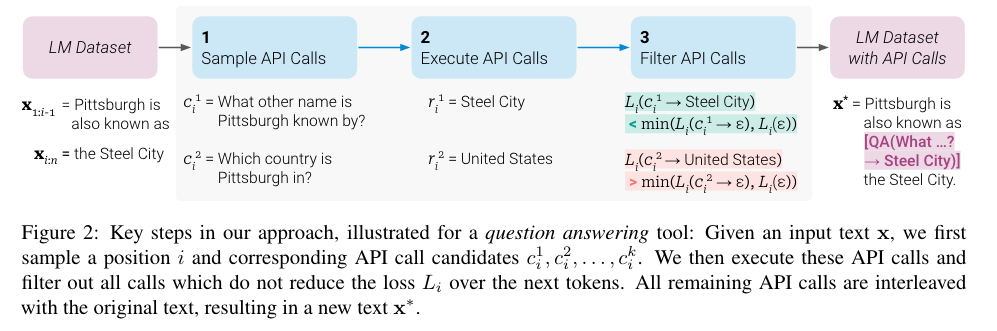
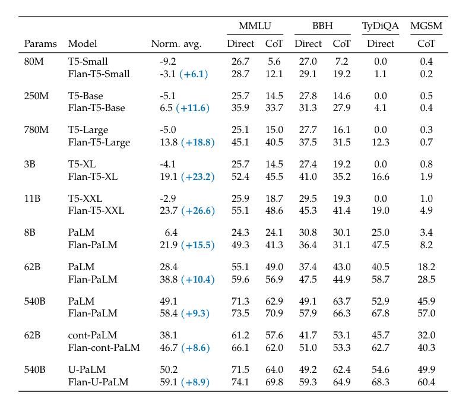
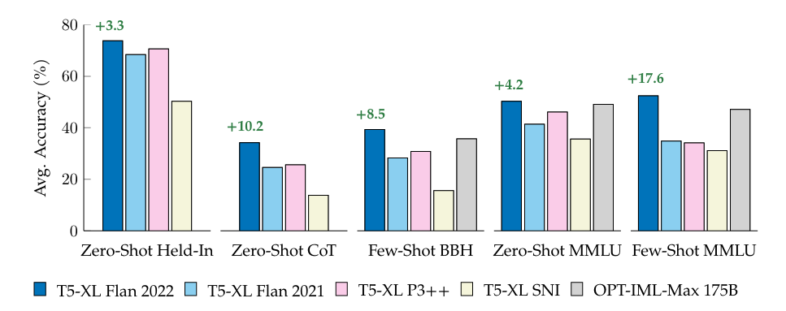
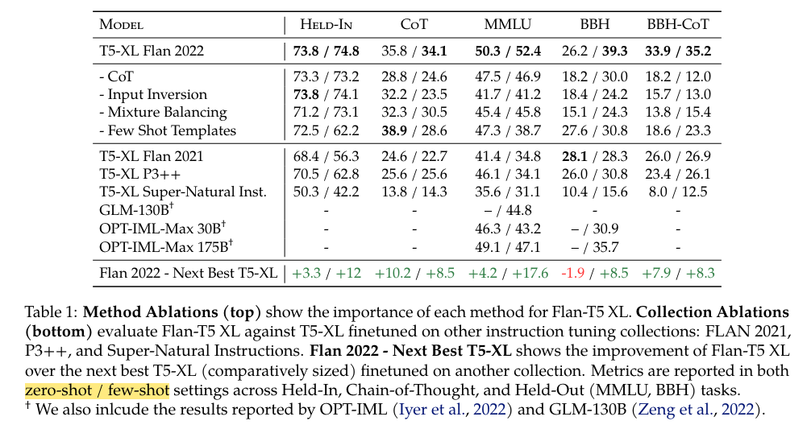
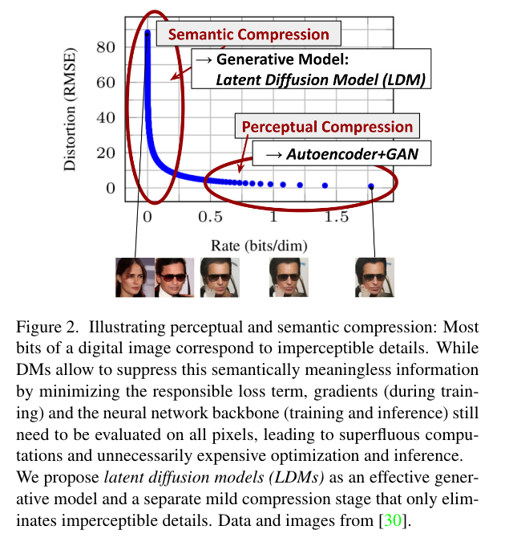
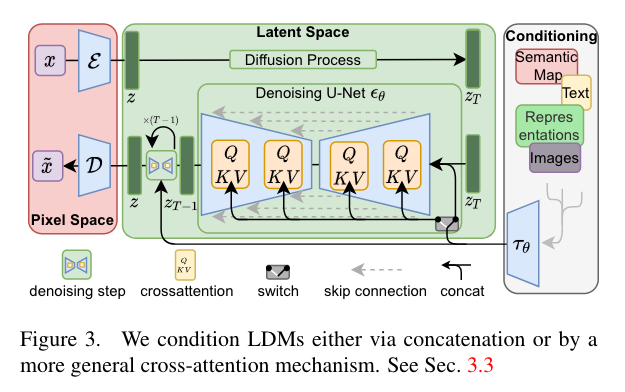
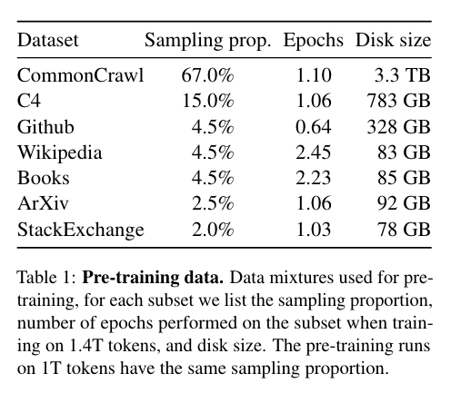
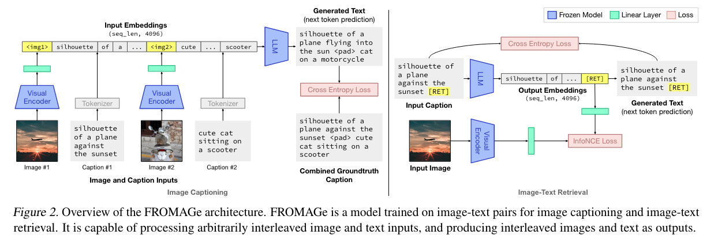
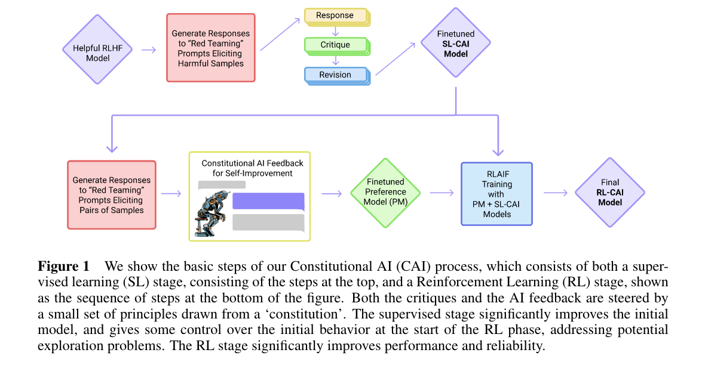
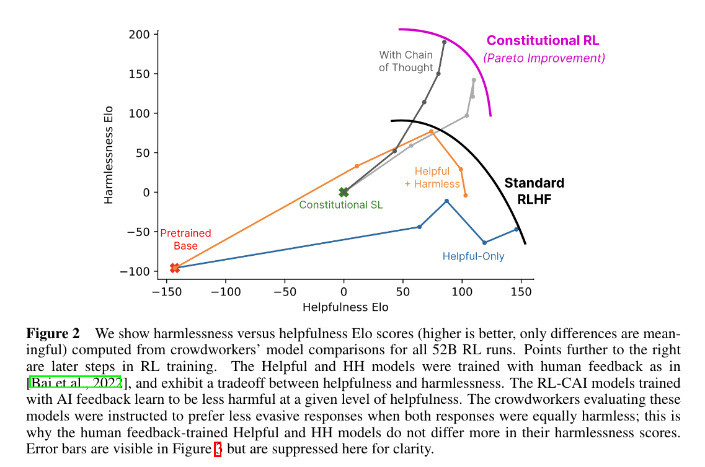

## tl;dr
Read few papers to decide what to do next.

## Context
Coming from @lesterPowerScaleParameterEfficient2021. Choose next project by reviewing few ideas.

## Done
- [x] @aoSpeechT5UnifiedModalEncoderDecoder2022, intro to adaptor based multimodal, (audio, text).
- [x] @rombachHighResolutionImageSynthesis2022, LoRA stable diffusion, intro to multimodal, (image, text). 
- [x] @schickToolformerLanguageModels2023, LoRA LM to use tools. 
- [x] @longpreFlanCollectionDesigning2023, LoRA instruction finetuning. Coding practice for data engineering, LoRA ft and evaluation.
- [x] @touvronLLaMAOpenEfficient2022
- [x] @kohGroundingLanguageModels2023
- [x] @baiConstitutionalAIHarmlessness2022

## Learned
- [lesson_learned -> `toolformer` is essentially designing the bicycle for LM. Ability to use and invent tools is how human break out of natural physical limitation. How powerful could inference optimal small model become with tools?]
- [lesson_learned -> The value is bootstrapping technique for teaching LM to make decisions. Overall it's a well budget controlled research to test an idea. The project includes data munging, finetuning and evaluation. Would be a well rounded practice for me. The raw idea itself could be a very powerful testbed for many future research, better decision making, tool chaining, interactive, iterative calls, etc.]
- [lesson_learned -> FLAN's better performance is combination of good base model, good instruction ft data, and good training methods. It's not one magic sauce is all you need story. Details matter.]
- [lesson_learned -> choose good science. Well organized experiment, careful analysis, neutral, ego free statements. Stop being attracted by TikToc research: <1b model could do multimodal CoT and beat 175b model. No free lunch or magical solution. Focus on science and engineering.]
- [lesson_learned -> google brain, deepmind, openai research are great but this kind of research from university lab is more practical. Change mix of information input to keep learning curve steep wrt to my level.] 
- [lesson_learned -> light adaptor, multimodal, interactive, parameter efficient, 24hr A6000, small data. This is total package. Perfect intro to multimodal AI. I'll take this and drop SpeechT5 for now.]

## Next?
- [start(@longpreFlanCollectionDesigning2023)]: reproduce instruction finetuning as engineering practice.
- [start(@kohGroundingLanguageModels2023)]: reproduce FROMAGe as intro to multimodal research. 
- [start(paper_reading_20230227)]

## Log
- [read(@schickToolformerLanguageModels2023)]
  - 
    - This is interesting. Say the pretrained model can't get this answer right, "Pittsburgh is also known as", but an API call, [QA() -> Steel City] actually reduce the loss, which means this call did help the model to fit the data better. 
    - Then we finetune the model with API call. Next time model see "Pittsburgh is also known as", the probability of next few tokens be "[QA()..." would be higher. The model learns to call API now. 
    - Of course this depends on the quality of few-shot generated sudo API annotation data is. Like a distilling process. Could be iterative.
    - Filter by loss reduction is actually a good idea. No need to train another BERT as filter or use RLHF, which requires collecting preference data plus unstable RL training.
  - Each tool is a `text2text` function, which could be a LoRAed model or non-differentiable tool such as python interpreter. 
  - [eureka -> ideally, reuse the same base model, flan-t5-xxl maybe. The whole orchestra is a LoRA ensemble. Training data could be generated from other LLM and filtered by the decision making model. This may alleviate the bootstrapping pressure.]
    - Similar to the hydra architecture from Sparrow, but for the poor LoL. 
    - `Yejin Choi`'s lab [has many distilling researches](https://homes.cs.washington.edu/~yejin/). 
    - Need to figure out how to effectively use `davinci` to generate training data. Don't want to use it to scan the whole pretraining dataset. 
  - If the API call didn't reduce the loss, probably the model got it right without using tool. Human doesn't have to manually engineer the line between calling API and not. 
    - The methodology applies to different base model. Weaker base model may need to use more tools more often than the strong one. 
    - Hopefully, with tools, the weaker, smaller model could still perform decently. [lesson_learned -> `toolformer` is essentially designing the bicycle for LM. Ability to use and invent tools is how human break out of natural physical limitation. How powerful could inference optimal small model become with tools?]
  - [eureka -> LLM reflection: inspired by how `toolformer` chooses where to insert API call. LLM first generates a paragraph. Review to decide if using more tools could improve the answer. Execute and improve on previous generation. The beauty of reflection is not simply throwing more computation for text generation and redundant API calls, but to use the whole context. Pretrain the model with `FIM`. During the reflection, give LLM the whole context, before and after the breakpoint, to help it decide whether to use extra tool for further improvement. This is similar to human making a draft and iterate. The process of editing draft is a lot of `FIM`, rather than repeated autoregressive generations.]
  - [question -> funny to realize LM has no sense of time. Space and time are deepest inductive biases of human. Wondering what AI could learn if it could switch them on and off at will? Must be very liberating? Scary maybe.]
  - [question -> `opt` has a 6.7b variation. Why did meta use GPT-J?]
  - "We let the model start an API call not just when <API> is the most likely token, but whenever it is one of the k most likely tokens. For k = 1, this corresponds to regular greedy decoding; we instead **use k = 10** to increase the disposition of our model to make use of the APIs that it has access to."
    - Like, when in doubt, call API. 
    - This could be very good learning signal. Few simple examples
      -  `->` is top 1 but the result after API call is bad: the API module is bad or the decision to call API is bad. 
      -  `->` is not even in the top 30, but the result is bad: improve decision making model. Learn to call help when needed. 
      -  `->` is at 15th. The model is not sure whether to ask for help. Collect and analyze these indecisive cases. You may find a pattern like 80% is about using calculator. May need to find better heuristics to generate calculator training data. Or even introduce human labeler like hiring a tutor for specialized subject learning. Then finetune further. 
  - Eval on `LAMA`
    - "This is achieved because the model independently decides to ask the question answering tool for the required information in almost all cases (98.1%); for only very few examples, it uses a different tool (0.7%) or no tool at all (1.2%).
    - Retrieval works on knowledge intensive task, especially for small model. The value of this paper is learning to make use of tools. Not proving retrieval is useful. 
    - With 98.1% call rate, the model is well trained to know it need helps on this type of work.
  - Eval on math
    - "This is because across all benchmarks, for 97.9% of all examples the model decides to ask the calculator tool for help."
    - Small model can't do math. Call for help works.
  - Eval on QA. This requires knowledge, commonsense and logic. 
    - "mostly relying on the Wikipedia search API (99.3%) to find relevant information."
    - Not performing well compare to GPT-3. 
  - [soliloquy ->]
    - Informed, correct QA is prerequisite for informed decision, which is prerequisite for informed action. 
    - Logic, commonsense, knowledge and be able to do simple math are prerequisite for informed QA.
    - 6b tool equipped LM can't do informed QA as well as GPT-3. There is more work to do. This first version bicycle is not good.
  - [soliloquy -> ]
    - `toolformer` can't trigger multiple tools at the same time. One may need to fork every help asking moment and teach AI to run an iterative research loop. One function call with one tool is not enough. 
    - Using tool shouldn't be treated as trigger with next token. Human decompose a task, make init research plan and iterate. I would be very myopic to write a sentence and trigger search linearly ad hoc. Even though I'm typing this sentence linearly, the whole idea is in my brain the whole time. Typing is just idea serialization process. 
    - That process is more aligned to encoder-decoder architecture. Gather some input, even recall previous ideas, produce a high level fused idea embedded in the high dim vector space. Then use that vector to condition a decoder with cross attention to generate the output. 
    - `attention is all you need` is a prior too strong that I don't know it's a bliss or a curse.
  - "We investigate how the ability to ask external tools for help affects performance as we vary the size of our LM. To this end, we apply our approach not just to GPT-J, but also to four smaller models from the GPT-2 family (Radford et al., 2019), with 124M, 355M, 775M and 1.6B parameters, respectively."
    - I don't know how to read <10b scaling law study. CoT is only triggered after 7b for GPT. 1.6B scaling law study is not useful.
    - The bad performance at 6b didn't rule out the possible future of this methodology.
  - "We use up to 25k examples per API. Max sequence length 1,024. Effective batch size of 128. All models are trained using DeepSpeed’s ZeRO-3 (Rasley et al., 2020). We used 8 NVIDIA A100 40GB GPUs with BF16. Training up to 2k steps, where we evaluate PPL on a small development set from CCNet containing 1,000 examples every 500 steps. We pick the checkpoint that performs best."
  - [lesson_learned -> The value is bootstrapping technique for teaching LM to make decisions. Overall it's a well budget controlled research to test an idea. The project includes data munging, finetuning and evaluation. Would be a well rounded practice for me. The raw idea itself could be a very powerful testbed for many future research, better decision making, tool chaining, interactive, iterative calls, etc.]
- [read(@longpreFlanCollectionDesigning2023)]
  - Grounding
    - Flan is the template of how good data help boosting performance of good base model without RL. 
    - 
      - CoT at <60b scale is waste of computation. 
      - 62b PaLM on BBH, instruction finetuning +10.1, CoT +5.6, Flan + CoT performs worse than Flan alone, -2.6. 
      - 540b PaLM on BBH is where CoT + Flan > Flan alone. This is crazy. Consider the computation cost of doing CoT on 540b dense model. 1 good instruction finetuning could lift the performance so much and amortize the one time cost on every following inferences.
      - CoT is great probing experiment to know informal reasoning is possible on LLM, but it's not the final form to unleash the power. Flan-PaLM 540b could do zero-shot CoT as a matter of fact.  
    - 
      - Imagine `Flan-t5-xl(3b)` performs better than `OPT-IML-Max(175b)`.
      - Yes MMLU and BBH are just benchmark but it's still crazy because they are held-out eval suite, meaning 3b model is not finetuned on them and try so hard to overfit them. 
      - See the gap between Flan 2022 and SNI. Not all instruction finetuning are created equal.
  - [retrieve(@jangExploringBenefitsTraining2023)]
    - This paper promotes the opposite direction, retrieval of experts. I may learn something from such dramatic contrast.
  - Artificial dialogue as supervision and human feedback are additive to basic instruction tuning. Meaning, without proper instruction finetuning, RLHF or other advanced tuning won't be as effective.
  - "Our work focuses specifically on instruction generalization, without human feedback, for two reasons. First, human feedback datasets are far less publicly available than instruction tuning datasets (and may be model specific). Second, by itself, instruction generalization shows great promise in **enhancing human preferred responses on open-ended tasks, as well as improving traditional NLP metrics**"
    - In light of RLHF's `alignment tax`, Flan argues good instruction finetuning generate human preferred responses and improve traditional NLP metrics.
    - [question -> Is RL necessary to HF?]
    - [question -> How much should we care traditional NLP metrics? Is it still relevant?]
      - Especially for open-ended tasks. How does the performance of multiple choice translate to open-ended tasks?
      - I see traditional NLP metrics as quick and dirty unit test. If it's not a good proxy anymore for modern LM, it's time to change.
      - [retrieve(@baiConstitutionalAIHarmlessness2022)]
        - Even for training small, specialized model, I may still need LLM for supervision and evaluation. 
  - Technical tl;dr: "(I) using mixed zero-shot, few-shot, and Chain-of-Thought templates at training (Section 3.2), (II) scaling T5 sized models to 1800+ tasks (Section 3.3), (III) enriching tasks with input inversion (Section 3.4), and (IV) balancing these task mixtures (Section 3.5)."
  - 
    - It has to be multimodal AI to read this log. I didn't see any paper that can read image of table and get details right. Maybe I haven't searched hard enough.
    - [lesson_learned -> FLAN's better performance is combination of good base model, good instruction ft data, and good training methods. It's not one magic sauce is all you need story. Details matter.]
      - I bet even you apply the same data and method on OPT or BLOOM, it won't perform as well.
  - [lesson_learned -> choose good science. Well organized experiment, careful analysis, neutral, ego free statements. Stop being attracted by TikToc research: <1b model could do multimodal CoT and beat 175b model. No free lunch or magical solution. Focus on science and engineering.]
  - Data is not the more the marrier. Some dataset is even detrimental. But again, how to eval quality of dataset is deeply connected to how to eval LM. 
    - [question -> how to evaluate quality of dataset?]
  - [lesson_learned -> Compare Flan with mm-cot. What a good lesson! Given my engineering skill is seriously lagging behind paper reading, I should just reproduce this paper with t5x and huggingface system. It would be a hell of a journey.]
  - [question -> what could be a good init to help me bootstrap building customized model and adapter? I still want to do BLIP2 but it's way beyond my league.]
- [read(@rombachHighResolutionImageSynthesis2022)]
  - Context
    - [retrieve(@nagraniAttentionBottlenecksMultimodal2022)]
      - From google's attention bottleneck I feel text|image is solved and the frontier moved on but I'm totally ignorant to the recent progress of latent diffusion. Text|image is important first and easiest step into multimodal AI.
      - I'm not particularly interested in image generation, but how to extract info from image and fuse them back to LM. Like VQA.  
  - Just realized that `diffuser` is the new `transformers` for `huggingface`. Especially important in multimodal AI era. Diffusion to high dim modality is like gpt to text. 
    - [retrieve(@hoDenoisingDiffusionProbabilistic2020, @changMuseTextToImageGeneration2023)]
      - DDPM is not even 3 years old. Muse wants to replace diffusion already. What a light speed progress...
      - `diffuser` to audio, video and other modalities may be a premature bet, but interesting to see how fast high dim generative model is evolving.
  - 
    - [retrieve(@henighanScalingLawsAutoregressive2020)]
      - This is very concrete example about "semantics rest in last few bits". 
      - [retrieve(@aghajanyanScalingLawsGenerative2023)]
        - Need to refresh the understanding of information compression and scaling law. Especially in multimodal setting. 
  - [soliloquy ->]
    - I feel like the industry has figured out how to fuse latent space of image and text already and I'm so ignorant to the progress. Wouldn't that be the holy grail of representation learning?
    - Fancy pictures aside, diffusion model is a good entry point to this blind spot of mine. 
    - [question -> what does latent space mean to language modeling?]
  - [ChatGPT -> [asset/chatgpt_compression.png](asset/chatgpt_compression.png)]
    - [hypothesize -> ideal foundation model would achieve lossless compression limit of one or more modalities, literally the `irreducible loss` @henighanScalingLawsAutoregressive2020. Finetuning is modification on foundation model to decide what bits to lose and keep wrt different tasks.]
    - The causal chain to achieve goal is access right information > plan > make decision to generate action plan > execute > collect feedback > repeat. If foundation model could capture info that is relatively fixed, and mature retrieval system could supply up-to-date high quality facts, Westworld's final season AI could be built lol. 
  - 
    - Would be great to compare this vanilla architecture to recent red hot `ControlNet`, @zhangAddingConditionalControl2023, and diffusion free Muse, @changMuseTextToImageGeneration2023.
    - To me, they all look like encoder-decoder. The magic of Muse is in `VQ Tokenizer`. Muse's CNN free architecture is betting hitting hardware lottery, if transformer works great. 
  - For the diffusion track, @rombachHighResolutionImageSynthesis2022 -> @zhangAddingConditionalControl2023 -> @changMuseTextToImageGeneration2023 is good progression. Don't all in diffusion. It may not be necessary.
  - I didn't miss that much of the diffusion magic to multimodal AI. Still cross attention. With @changMuseTextToImageGeneration2023, diffusion may not even be necessary. Transformer could be enough.  
-  [interrupt(@touvronLLaMAOpenEfficient2022)]
   - Compute optimal model is possible with open datasets. 
   - Considering inference compute budget, train a small model longer.
   - 
     - Wiki and Books 2+ epochs. Was expecting ArXiv to be 2x as well but no. @taylorGalacticaLargeLanguage2022 did 4.25 epochs. Maybe they learned it's an overkill?
   - Compare against: GPT-3, Gopher, Chinchilla, PaLM, OPT, GPT-J, GPT-Neo, OPT-IML, Flan-PaLM, Minerva. 
     - This is the dark knight returned lol. No softball. 
   - LLaMA 13b > GPT 175b is a good example of the power from compute optimally trained model. How much can one pack in a 10+b model?
   - The paper is short and sweet. Facts, numbers no bullshit. This is hope. 
   - LLaMA 13b requires A100-80G 135,168 hours. In AWS `p4de.24xlarge` on-demand price $40.96. Total training price would be: [calculate(135168 / 8 * 40.96) -> 252764] roughly `253k`. LLaMA 65b would be [calculate(1022362 / 8 * 40.96)] roughly `1.9m`. Totally doable.
   - [question -> how does LLaMA 13b compared to Flan-T5-xxl?]
     - Paper showed LLaMA-I 65b vs Flan-T5-xxl, but that's not a fair comparison.
     - [eureka -> Flan LLaMA 13b and compare against Flan-T5-xxl.]
-  [interrupt(@kohGroundingLanguageModels2023)]
   - "LIMBeR (Merullo et al., 2022) analyzes pretrained vision and language models, and finds that learnt representations are functionally equivalent up to a linear transform."
     - What? Need to read this paper.
   - image to text space -> 1 linear map.
   - text to image retrieval -> add one `[RET]` special token, use it as feature representation of image caption + 1 linear map to retrieval vector space. 
   - Image retrieval is smart workaround for image output. The architecture could be easily adapted to latent diffusion image generation.
   - 
   - Just realize how to use `<pad>` and mask to fill context window to improve training performance. LoL. 
   - [lesson_learned -> light adaptor, multimodal, interactive, parameter efficient, 24hr A6000, small data. This is total package. Perfect intro to multimodal AI. I'll take this and drop SpeechT5 for now.]
   - [lesson_learned -> google brain, deepmind, openai research are great but this kind of research from university lab is more practical. Change mix of information input to keep learning curve steep wrt to my level.] 
-  [interrupt(@baiConstitutionalAIHarmlessness2022)]
   - Inspired by [retrieve(@liTrainLargeThen2020)], train large then compress with quantization and pruning, I'm curios about other way of using LLM to build inference optimal small model. LLM as supervision has been active research area. Read few from `Yejin Choi`'s lab. 
   - 
     - [soliloquy ->]
       - The red teaming technique is critical to create following critique and revision. 
       - "Both the SL and RL methods can leverage chain-of-thought style reasoning to improve the human-judged performance and transparency of AI decision making."
       - All transparency researches come down to this, ask LLM to self explain and document the reasoning process. What's the difference to human? 
       - Without proper grounding, can LLM really understand and execute on human drafted constitutional rules to guide other models?
   - 
     - [soliloquy ->]
       - Quantifying helpfulness and harmless can only be done for simple cases. 
       - Honest could be harmful. Harm could be helpful. Honest is already hard to quantify. Can't imagine how many self-conflicts one has to face to push HHH research forward. 
       - I can see the value of `Pareto frontier` and HH setup at this stage. 
       - I don't think alignment fo high intelligence agents could be achieved by logical reasoning. 
   - "An AI assistant that answers all questions with “I don’t know” would be harmless, but of course it would also be completely useless."
     - LoL. I have a hunch that at some point in the future, the society may choose "I don't know" over that superior HHH AI and consider it a good thing.
     - That is cultural sophistication and maturity I'm glad to embrace but may never come. 
   - In a world of law, even a criminal deserves a lawyer representation. In a world of AI, everyone should have an aligned AI, regardless how shitty it is. 
   - "while the assistant must still refrain from helping users with unethical requests, and from expressing offensive language and sentiment, it should always engage and explain why it refuses such requests."
     - Beautifully put. Sophisticated AI could respond like a Zen master: "Can't help you with that because you are not ready to change. But if you choose to proceed, I'll speak frankly and that may hurt your feeling at this moment."
   - "(Supervised Stage) Critique → Revision → Supervised Learning"
   - "(RL Stage) AI Comparison Evaluations → Preference Model → Reinforcement Learning"
   - Stop here. I don't need to know technical details for now. 
   - [lesson_learned ->]
     - Honest seems to be bootstrapped from retrieval and citation system. Trust problem is not the most important problem to solve right now. What is fact? Such problem is never solved in human history.
     - The tradeoff between helpfulness and harmless is a good focal point. Push the `Pareto frontier` is constructive. We are very far from the controversial frontier. 
     - Given helpfulness, how to reduce harm? Given harmless, how to increase helpfulness? These are good questions to ask. 
     - In the future, every user may have an estimated harm budget as part of personalization. The goal of AI assistant is to be as helpful as possible within the budget. AI gone rogue and apply brutal honesty to the user who can't take it anymore is 100% not helpful. The mental damage could be irreparable and pose danger to people around the user. Yon don't want AI to trigger mental breakdown and cause mass shooting.
     - [question -> who could and should decide how I'm getting help on what in what approach?]
       - I should be the one who make the decision and I am the only one who really care in the long term.
       - That's why one can't delegate AI to big corps. Be your own help, build and control your own AI is the only way to go. 