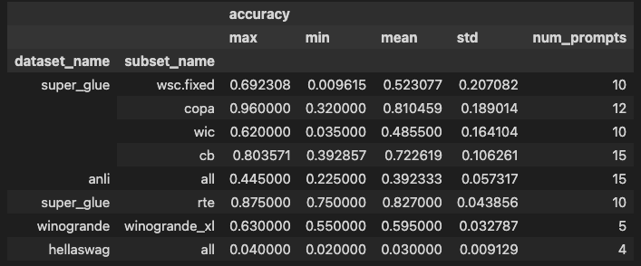
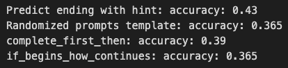

## What I've done?
- I didn't do big-bench and skip `StoryCloze` evaluation. Would revisit big-bench when I'm ready to do finetuning with `t5x` and `seqio`. 
- I do reproduce the T0 eval performance for the rest. They are very close to reported number from the paper. 
  - 
  - `hellaswag` revisited:
    - 

## What I've learned? 
### The difference between evaluating `language modeling` and more general `text2text` interface
- The author frames all eval tasks as text classification to test the performance of underlying language model as giant text joint distribution by conditioning the model with the prompt and compute `sequence logprob` of each answer candidate to choose the max `logprob` as model response. 
- This is drastically different to my approach, by treating LLM as `text2text` black box and judge the performance on generated output. 
- Author's approach makes the whole evaluation easier. I have to deal with fuzzy output and post processing. However, such testing methodology is very very far from LLM real world use case, I'm thinking chatbot or other more open ended interacitons. This is the same problem like human IQ test.
- With `chatgpt` in mind, one should think long and hard about how to evaluate modern LLM. Traditional academic evaluations are optimized for easy evaluation, easy comparison across papers, hence easy paper publication. I don't have that shackle. 
- Evaluating AI would be harder than evaluating people from now on. True capability and true alignment are hard to gauge.

## Reference
- [huggingface T5](https://huggingface.co/docs/transformers/main/en/model_doc/t5): read it cover to cover would save you a lot of time later. 
