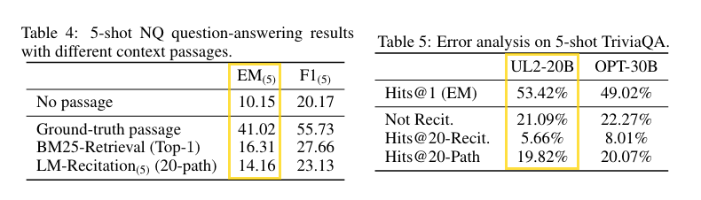
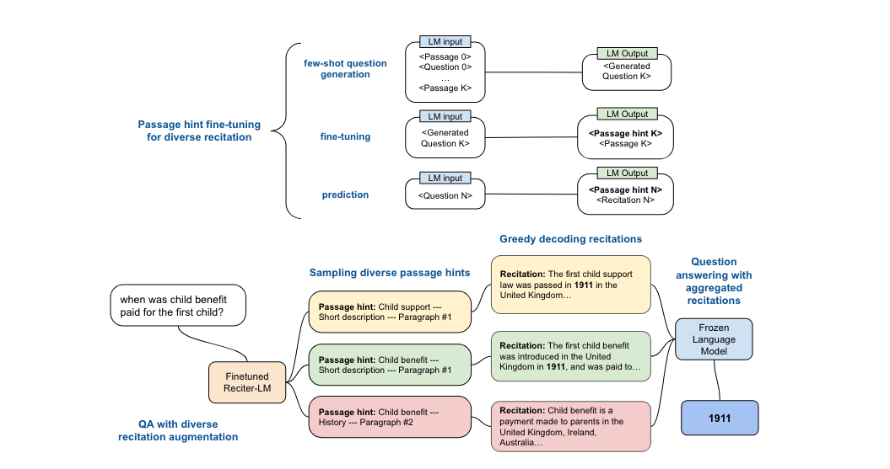

## What I've done?
- Read the paper twice and very light coding to realize it's not worth digging deeper. Still good learning to QA task.

## What I've learned?
### LLM as retrieval backend
 
- Tab4 is for UL2 20b. 
- Breakdown QA into 2 tasks: research and answer. 
  - No passage EM score is testing LLM close book knowledge + answering end-to-end. Clearly long way to go. 
  - $\Delta(gtruth, BM25)$ = retrieval quality
    - This is what search engine has been doing for decades.
    - Embedding and vector search is retrieval 101 use case now. 
  - $\Delta(gtruth, recit)$ = recitation quality
  - $\Delta(gtruth, 100)$ = answer aggregation
    - **Worthy research direction.**
  - $\Delta(recit, BM25)$ = how effective LLM as retrieval backend. 
    - Clearly, UL2 5-shot 20 path SC, cost A LOT!!!, is not an effective use of computation resource. 
    - Assuming the performance scales with model size, still don't think LLM as knowledge base and retrieval mechanism is a good idea.

### Answer aggregation
- One-hop QA may be achieved by finetuning. Multi-hop QA, especially for complex or unclear question, requires more than one pass over LLM. It's rationale engineering. 
- QA is an interactive process. Focus on one-hop is myopic.
- LaMDA, Sparrow, and WebGPT are the right approach to QA.
  - They are all multi-agent system with growing sophisticated rationale engineering, packaged as one black box chatbot. 
  - Definitely not one model, one agent system. Think of that chatbot as the receptionist of a company. Even though you feel like talking to one person, there are many people behind the scene.
- Retrieval system is google's trade secret. That's why LaMDA and Sparrow are pure in-depth answer aggregation research. The retrieval part is hidden as simple open web search. In fact, open web means all reachable info on Earth is reachable by google. 
- Now enter the Bing and ChatGPT.

### UX between pretrained LM and instruction finetuned LM
People's first experience to LLM is chatgpt. My current experience is mostly with flan-t5. UL2 is the first pretrained autoregressive model I try. It reminds me of how hard to get raw LLM to have ideal output. Need few shot, careful prompt engineering to get outputs that make sense. Just ask for what you want won't work at this level. Spoiled by flan and instructGPT family.

### Generate diversified recitation
- UL2 is a pretrained model. Can't just ask "please generate 8 relevant passages to the question."
- The finetuning hack in the paper is actually very smart, `passage hint`. 
  - Natural Question dataset contains (question, wiki pages) info. 
  - A wiki page is about a topic. A page contains many passages. Every group of passages has a hint. Every hint is essentially an aspect of the topic.
  - The assumption is diversified recitation improves answer quality. 
  - LLM contains knowledge, and every LLM pretrained with wiki. If we could finetune LLM such that knowledge are regrouped by topic and passage hint, like wiki page, such model may output diversified recitation about various topics with the cue of question and passage hint. 


1. Few shot LLM to do `fn(passages) -> questions`
2. Finetune LLM with supervision: `fn(question) -> (passage hint, passage)`
3. Generate passage hints and use them to generate diversified recitation
```
hints = ft_llm(question)
recitations = [ft_llm(hint) for hint in hints]
answer = llm(recitations)
```
#### Pros
- Finetuning pretrained model is folding raw distribution into certain shape that works better for target task. The observation of passage hint as proxy of diversity is acute. 

#### Cons
- Now you have 2 20b LLM to do one task. And the performance improvement is +~3%.
- My hunch is most of light finetuning on small model could be few shot by LLM. If the task is valuable enough, it may warrant a prompt tuning. Probably the whole process of generating diversified recitation could be achieve by instruction prompt tuning with 10k task specific parameters. 
- Or even better, since flan ft makes following instruction and CoT zero shot without RLHF, it's possible to instruction prompt tune flan-LLM to do multi-hop QA. 
- Such approach won't generate new model, and won't affect the performance of old model or other tasks. It's more efficient way of using computation resource. 