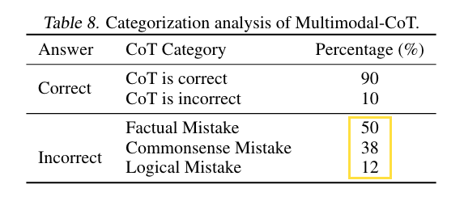

## tl;dr
There is no magical appearance of a CoT in a model with less than 1 billion parameters, nor is there an easy solution to the multimodal problem through gated fusion.

## Context
[CoT](https://github.com/lukaemon/seed/tree/main/paper/weiChainThoughtPrompting2022), [SC](https://github.com/lukaemon/seed/tree/main/paper/wangSelfConsistencyImprovesChain2022a) and [recitation](https://github.com/lukaemon/seed/tree/main/paper/sunRecitationAugmentedLanguageModels2022a) give me decent understanding of in-context learning. 
However, I have only 2 options to continue rationale engineering research:
- Pouring money into 8*A100 to run 100b+ model.
- Pouring money into OpenAI api. 

Not interested in either. Want to max out my local 2*3090 first. 

Inspired by [recitation](https://github.com/lukaemon/seed/tree/main/paper/sunRecitationAugmentedLanguageModels2022a) and [RETRO](http://arxiv.org/abs/2112.04426), I want to learn more about retrieval because it could solve knowledge problem and text should be the easiest modality to fuse with LLM. RETRO could be the first step towards multimodal system. However, RETRO is too hard for me at this point so `mm-cot` is even better starting point. Image here is essentially text so it's text-text multimodal like RETRO. The code and math are much easier to understand. So we begin.

## Done
- Deep conversation with the paper.
- Reproduce gated fusion in `model.py`

ps: download data and vision feature per [instruction](https://github.com/amazon-science/mm-cot).

## Learned
- Interesting experience to implant `gated fusion` into huggingface T5. 
- There is neither magically emerging CoT in <1b model, nor easy fusion to solve multimodal problem.
- Understand the purpose of multiple choice dataset. Don't be over obsessed. That accuracy number is a proxy to what UX improvement you care about? However, improved accuracy could be a proxy to new technical understanding. Don't over discount it. Just stay calm and think it through.

## Next?
Idea: Help LM to make better informed decision and push the multistage finetuning a little bit:
  - It could be 4 stages:
    1. finetune enc-dec to generate detailed description of the image from detr feature set, conditioned on the question: `fn(image, question): image description`
    2. finetune open web n_top search retrieval summary: `fn(question, image description): retrieval_summary`
    3. finetune `fn(question, image description, retrieval_summary): rationale`
    4. finetune `fn(question, image description, retrieval_summary, rationale): answer`
  - Use LM to fill in blanks to compensate info loss from pixel to text. 
  - Conditioned on the question. The same why read the question and options first in reading comprehension test before reading the passages could boost the performances. Priming the brain with goals to efficiently spot useful info.
  - Maybe further condition image description with caption, anchor the image to reduce hallucination.
  - I don't know if this recursive finetuning is a good idea, or they actually could be done in parallel, or they are meaningless fight within <3b regime. Decoder generation is already recursive. `LaMDA` and `Sparrow` had learned to do web search. Incorporate CoT and image features are just expected incremental improvement. However, even though 100b+ model could definitely do it with less manual engineering, if 3b model could do it with good performance, it could still be useful for interactive and mobile application.

Critique: 
- multistage finetuning is waste of resource because the manual engineering effort mostly won't transfer to new dataset and new task. 
- Yes the model is small, 10x t5-base is smaller than 1 t5-xl, but the impact is even smaller. Plus, you won't have 10k+ examples with cot annotation to finetune for every new task. 
- Prompted base self-ensemble on LLM is more efficient for building parallel or cascading ensembles.
- Multiple choice is not a real task... It's cheap unittest for LM. Small model could over fit one multiple choice dataset and I still don't see how such improvement would translate to UX improvement for real world application.
- My hunch is finetuned large (QCM→R) -> (QCMR→A) would perform very badly on `mmlu` or `bbh`. Won't see magical CoT emerge on 770m model.

--- 

Idea: Try all recently released `VLM`s, [COCA, GIT, BLIP-2...](https://huggingface.co/spaces/nielsr/comparing-captioning-models)

Critique:
- (image, text) -> text2text is not a direction worth digging. Natural language is for multiagent communication. It's not an effective medium to do sensor fusion. 
- I personally won't translate all vision to text in my brain and do text processing to reason, plan and act. Just because LLM is powerful processing tokens, doesn't mean it's the best way to process vision info.

---

Idea: Better fusion mechanism?  
Critique: Too vague. The whole multimodal research is about better fusion to facilitate better inference. 

---

Idea: `NeRF` as visual information encoder, decoder is conditioned on question as observational perspective. 
- An image is actually a prompt to the whole visual memory. The primed visual memory is the `functa` ready to be queried.
- If we could compress the visual memory of the world with neural network model, an input image plus a question would be the guide to the whole visual memory. A good VQA mechanism could use the guide properly and lead use to the answers. 

Critique:
- `NeRF` is differentiable visual rendering engine. Prompted by image and angle, it could render the different scenes.
- What I really want is similar differentiable rendering engine. Prompted by idea and perspective, it could render different interpretation. This is super vague and rough.
- Arguably, LLM is doing this already in text space. Again, this is at the core of multimodal research.
- I'm intrigued by the idea of `functa`. Let the bullets fly for a while.

---

💡Idea: `PEFT` on 11b model? Instruction prompt tuning? 

Critique:
- Even though I'm over finetuning small model to over fit a multiple choice dataset, `PEFT` `flan-t5-xxl` to over fit `MMLU` or `BBH` could be very good `PEFT` hello world to me lol. 
- However, say you gain better capability to over fit LLM to some hard datasets, still need to think deep and hard about what to over fit and why.


## Log
- Pseudo code
  ```python
  # given text and image input
  rationale = fn(x_text, x_vis)
  answer = fn(x_text + rationale, x_vis)


  def fn(x_lang, x_vis):
      """encoder decoder transformer
      x_lang: text input, (n), len of text input 
      x_vis: image input, preprocessed by DETR, (m), m patch
      """
      h_lang = encoder(x_lang)  # (n, d), d=hidden dimension
      h_vis = W_h @ x_vis  # (m, d)

      # text image cross attention to get text conditioned image feature
      # in the first pass to get rationale, the image feature is conditioned by question
      # in the second pass to get answer, the image feature is conditioned by question plus rationale
      # shape is dominated by q=h_lang. k,v=h_vis
      h_attn_vis = softmax(h_lang @ h_vis.T / math.sqrt(h_lang.shape[-1])) @ h_vis  # (n, d)

      # gated fusion
      r = sigmoid(W_l @ h_lang + W_v @ h_attn_vis)
      h_fuss = (1 - r) * h_lang + r * h_attn_vis  # (n, d)

      # generate text output autoregressively
      y = decoder(h_fuss) # (o), len of text output
      return y
  ```
  - 2 enc-dec pass per QA. The first is to get rationale. The second is to get answer.
  - The glue architecture here is cross attention plus gated fusion, introducing 3 more matrices, W_l, W_v, W_h.
  - 2 stage finetuning matches 2 enc-dec pass per QA. Contribution: new rationale engineering formula.
    - Previous few shot or zero shot CoT are 1 pass generation for both rationale and answer with decoder transformer. 
    - 2 pass approach with end-dec, a form of sparsity, helps better condition the decoder with `h_fuss` to achieve better generation? 
    - What does 2 stage finetuning really mean? Divide and conquer in the training phase? Like CoT makes output auditable, 2 stage finetuning makes training explainable?

- A lot of manual engineering
  1. One matmul to enter `x_vis` into hidden space. 
  2. The whole process of modality fusion.
  3. 2 pass answer generation. 
  - Could these all be replaced by doing few-shot with `Flamingo`, and `instruction prompt tuning` to make it zero shot? 
  - That said, `gated cross attention` in `Flamingo` is designed as well. Modality fusion is open question. The beauty of this paper is simple and easy engineering to get multimodal QA working better. Amazed that 3 new matrices and 2 line equation about gated fusion could make such a big difference.

- Multimodal vector space
  - `DETR` is the major effort to get mutual information of image and text. `h_vis` will go through non-linearity in fusion and decoding phase plus all param finetuning would definitely adopt. 
  - `T5`'s hidden space is language dominant by design. Use caption or `DETR` are actually good hack to avoid dealing with creating a vector space that both image and text are first class citizen. 
  - Maybe `DETR` keep more info than caption, or extract more useful info for this ScienceQA task. Compares to raw info reserve in pixel space, how to adjust the level of info and what info to extract for downstream task. The goal is definitely to find a learnable approach. 
  - The journey to ground an image to text hidden space is too manual here. May become a bottleneck to future development? 
  - For the purpose of creating native multimodal vector space, I do see the value of Yann's agenda to promote joint embedding predictive architecture, `JEPA`, and the warning of maximum likelihood method. The warning is extremely harsh and uncomfortable under current context of Sparrow, ChatGPT, Claude, Bard and Bing, but true. 

- Error analysis  
  - 
  - Factual mistake could be solved by retrieval augmentation.
  - Common sense and logical mistake could be solved by scale. Can't afford that route. How to do better in <3b regime?  

- Realized that rationale generation and answer generation are 2 separate finetuned models. Thought they are 2 pass finetuning on the same set of parameters.
  - Now I see why people really want to push `fondation model` paradigm. 
    - To solve a task, one rationale engineers a multistep reasoning process. On high level, it's a computation graph of functions, just like all functional programming software. Human had to engineer every single function, but now NN is eating that job.
    - In this `ScienceQA` task, the computational graph is simple:
      ```
      cot = generate_rationale(question, image_feature)
      answer = generate_answer(question, image_feature, cot)
      ```
    - This way of solving task just can't scale. 
    - `ScienceQA` has 12726 examples. Very hard to collect 10k examples for each new task. 
    - Engineered computational graph may not be useful for other tasks, as well as finetuned functions. 
  - Overall, 2 step finetuning here is just using 2 small t5 to tailor fit `ScienceQA`. I expect it won't behave like flan-t5, with decent performance on held out tasks.
- 2 pass finetuning is a form curriculum learning. 
- Use `DETR` vision feature is a good hack to tap into the power of LLM before we truly solve multimodal in vector space.
- These fixed engineering decisions are making good points for educational purpose but would be a futile direction to dig. The points are:
  - Modality fusion is necessary. Use all info you get to solve the task.
  - Rationale like system 2 thinking could help. 
  - However, fixed computational graph and tailor fitted functions are not even the shape of multimodal future. 
- I'll treat the project as finetuning practice and entry point of using `VLM`s, which are [making rapid progress recently](https://huggingface.co/spaces/nielsr/comparing-captioning-models). 
- No need to stick to source code anymore. Know enough to build a working version alone. Start with data exploration.

- To know how to prepare data for training, need to enhance vanilla T5 to do gated fusion. First modifying huggingface transformer model. Overwhelmed. Don't know where to start. Pseudo code is simple and clean but mapping it to hf library is new to me. Learn to collaborate with `ChatGPT` to understand and reproduce the code.
- mm-cot basically modifies huggingface `T5ForConditionalGeneration` [source code](https://github.com/huggingface/transformers/blob/eb6c59bc7826529122e916fb0ac8b303b23e8d64/src/transformers/models/t5/modeling_t5.py#L1501) to implement gated fusion. I'll try to do the same.

- During implementing gated fusing, I find my low level understanding about enc-dec architecture and attention mechanism is rusty. Time to reimplement a t5-small from scratch to refresh my memory.
- 10 new lines out of 170+ lines total are related to implement ideas in this paper in `model.py`. Feels like fighting the framework. However, I do get many features in return by adopting to hf framework. Its abstraction may not be the right abstraction for me. Tag along and fork when I need to.
- `__init__` working fine. Back to shaping data to test `forward`.
- Revisit paper
  - "Surprisingly, we observe a ↓12.54% accuracy decrease (80.40%→67.86%) if the model predicts rationales before answers (QCM→RA)."
    - Not surprising to me at all. CoT in small model is detrimental. Fit my experience and paper results from flan-t5. 
  - "Interestingly, with vision features, the RougeL score of the rationale generation has boosted to 96.97% (QCM→R), which correspondingly contributes to better answer accuracy of 84.91% (QCMR→A).
    - What's the purpose of doing rationale finetuning when CoT is detrimental in small? 
    - Rationale in the (QCMR→A) setting is misleading. It's more like `DETR` feature conditioned **caption**, made possible by gold rationales. 
    - Rationale finetuning with image feature do help the small model to better fit (QCM→R) distribution for this dataset. BUT! It doesn't mean such finetuning suddenly, magically enable small model to generate good CoT out of distribution. Can't even do CoT in distribution.
    - Still, (QCM→R) is a better way of using image info by leveraging `DETR` features and gold rationales. Better than static captions. Before, every LM is doing (QCM→A) and leaves image info on the table. 
- Compare and contrast `mm-cot` and `gpt3.5`:
  - `mm-cot` base: (QCM→R) -> (QCMR→A) achieves 84.91%.
  - `gpt3.5`: 2 shot (QCM→A) achieves 73.97%. 
  - 2 shot performance here is more impressive to me. The generality of gpt3.5 is crazy. 
  - Not much to push in (image, text) -> text2text pseudo multimodal anymore. The paper has tried `clip` and `resnet` features. No difference. I don't see how cutting edge `VLM` caption would make a dent. The real breakthrough would come from native multimodal model such as `Flamingo`. 
- I'm over finetuning small t5 to fit ONE multiple choice dataset. The improved `rougeL` or `accuracy` means nothing to downstream real world task. There is no magic to achieve multimodal CoT with small model. 
- Stop project here and move on.
