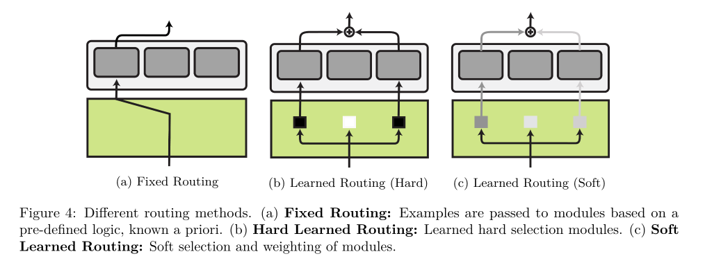

## tl;dr
Modular design could be more efficient and performant. Plus the possibility of distributed and async community participation. What a beautiful paper. 

## Context
Was about to start project kohGroundingLanguageModels2023, then I saw this paper, which would show me the forrest before I start to chop the trees.

## Done
Read the paper cover to cover.

## Learned
- [lesson_learned]
  - Great research direction. Very complimentary to @mialonAugmentedLanguageModels2023. Imagine a modular design to continually learn new knowledge, skill and tools. And the possibility of community participation. I want that future.
  > Modular deep learning transcends the confines of private research: it enables community-driven sharing, expanding, reusing, and updating of the modules.
  >
  > AdapterHub as continuously updating community-distributed multi-task models.
- Modular, multimodal, multiagent and multitool model are all related. [question -> what is the proper API for such system?]
- [question -> assume modular DL is a must, what kind of pretraining model architecture should be designed?]

## Next?
- [eureka -> I could compare and contrast Flan t5 vs module enhanced t5.]

## Log
- [read(@pfeifferModularDeepLearning2023)]
  - To achieve positive transfer, compositionality, and parameter efficiency, one needs to understand modules, routing function and aggregation function.
  - Key dimensions: 
    1. how they implement modules, which constitute the minimum unit of computation; 
    2. how they select active modules through a routing function; 
    3. how module outputs are aggregated;
    4. how the modules are trained with the rest of the model.
  - [soliloquy]
    - These module implementations are great reaffirmation of my previous understanding about `level of change`, they offer different trade-offs between efficiency and performance. I'm literally learning means of combination of nn modules.
    - Total ignorance to routing function. 
    - Aggregation function is interesting. Functional decomposition and composition come to mind, as in @huangComposerCreativeControllable2023 and @dupontDataFunctaYour2022. 
    - Integration of pretrained frozen model is my top favorite. I see a future to propagate level of change wrt to different computation budget. 
      - `Prefix tuning` may be the cheapest entry point. Instead of manual prompt engineering, local task adaptation by prefix tuning to local dataset is efficient, privacy preserving and autonomous.
      - LoRA adapter is the next step.
      - Finetuning adapter is more expensive. 
      - Design and train a new adapter is even more expensive.
      - Pretraining a new module will remain to the selected few. Like everyone needs energy but impossible for everyone to mine the oil and refine it.
  - Modular, multimodal, multiagent and multitool model are all related. [question -> what is the proper API for such system?] This question takes me back to the good old days of Scala actor model. 
  - 
  - 
    - This is crazy. Such simple algorithm and notations could explain many modular DL patterns. What a good mental framework!
  - The paper is very complimentary to @mialonAugmentedLanguageModels2023, which considers function and this one is about form. Together, they are the two sides of the same coin.
  - 
    - Means of combination between base model param and module param. 
      1. parameter composition, ex: LoRA, sparse finetune (SFT)  
        - pruning, adaptation, structured adaptation
        - low-rank module
          - minimum d that achieves 90% performance decreases during pre-training and larger models have lower d.
          - So large model is more sample efficient, learns faster and easier to be LoRAed. 
          - [question -> maybe focus purely on making good small model is the wrong wishful thinking. Leaving so many advantages of LLM on the table is not smart. The goal is achieve inference optimal wrt various computation budget. Small model is just one way and LLM may be better starting point of such optimization process.]
      2. input composition, ex: prefix tuning
        - "if φ is only concatenated with the first layer’s input, the model has limited capacity to adapt to a specific task. As a result, such continuous (also called soft) prompts perform poorly at smaller model sizes and on some harder tasks"
          - Learned this from [last project](project/hf_peft_example). The disillusion of PEFT lol. 
      3. function composition 
      4. hypernetwork
  - 
  - "... all modular computation functions can be reduced to function composition: $f_i'(x) = f_\theta(x) + f_{\varphi_i}(x)$"
    - Wow... I need a day to process this. 
    - Just a new function and addition? 
  - 
  - Learned routing is essentially learning to make decision of directing information flow, which faces `training instability`, `module collapse` and `overfitting` problems. 
    1. the need to balance between exploration and exploitation. 
    2. routing must share modules across examples or tasks in such a way as to reap the benefits of positive transfer while avoiding negative interference.
    - [question -> wonder how much RL could help here?]: 
      - few paragraphs later: "In Routing Networks (Rosenbaum et al., 2018), Modular Networks (Kirsch et al., 2018), and the Compositional Recursive Learner (CRL; Chang et al., 2019), a router network is trained through reinforcement learning."
  - Just realized token level routing `MoE` is actually very interesting. 
    > However, since routing is conditioned on the token level, and the load balancing restriction limits the system from routing an entire example to a single module, the system potentially has to relearn similar concepts in multiple modules. Hence, load balancing hinders the router from selecting the single best module for longer (e.g., repetitive) sequences. This is investigated further by Lewis et al. (2021), who find that sparse models route syntactically and semantically similar words (in contrast to sentences or phrases) to the same modules. This sheds light on the limited expressiveness of modules which are learned on the token-level. Since scaling is the main focus of these works, their goals are orthogonal to modular approaches centred on parameter efficiency, transfer–interference trade-offs, and combinatorial generalization.
    - It's not one new task, one or few modules for such task kind of simple mental image. 
    - "relearn similar concepts in multiple modules" may be a good thing, redundancy. 
    - "selecting the single best module" introduce point of failure. 
    - [question -> what if people could host FFN at home and join the global inference flow?]
  - Parameter aggregation could happen at both model weight and prompt. Wow!
    - $\theta' = \theta_0 + \varphi_{l} + \varphi_{t}$
    - Can even do semantic arithmetics: $\theta' = \theta_0 + (\varphi_{\text{general}} - \varphi_{\text{toxic}})$
    > Rather than sparse adapters, Asai et al. (2022) aggregate parameters of soft prompts learned via prefix tuning (§ 3.2). In order to generalize to new tasks, (frozen) modules from past tasks and a learnable module created for the new task are interpolated according to the weights of an attention mechanism between the modules and the input.
    - Attention on the soft prompt? Omg. 
  - Prefix tuning as input aggregation
    > Providing the model with multiple instructions, or with multiple examples (i.e. few-shot in-context learning) is a version of module input aggregation $f'1(x) = f{\theta_1}([\varphi_1, \dots, \varphi_{|K|}, x])$. This concept also extends to prefix-tuning, where we can simply concatenate all prefixes at every layer: $f'i(x) = f{\theta_i}([\varphi_i^{1}, \dots, \varphi_i^{|K|}, x])$.
  - [soliloquy -> reading PDF and keep annotation in a markdown is not ideal. So many contexts are lost. Wondering if AI native pdf reader could be market as strong as vscode and browser. Thinking about AI native Zotero combined with Obsidian note backlinking capability.]
    - [question -> how reading experience could be enhanced by AI?]
  - [interrupt([ChatGPT API release](https://openai.com/blog/introducing-chatgpt-and-whisper-apis))]
    - Can't focus this morning. 10x cheaper than davinci-003? Won't use API data for training? Delete after 30 days?
    - OpenAI and Microsoft are too powerful. Be careful to power worshipping and blind trust. Such power is not meant to belong to any single entity. Imagine selected few orgs own the vehicle of minds. WTH?
    - 你們是蟲子。I'm afraid of such power. 
    - Fear aside, now that API is out, I could start implementing my vision of talking to my own learning trajectory now. 
  - Goal of transfer learning:
    1. PEFT: efficient adaptation, prevents negative inference, zero-shot transfer.
      - Better adaptation to known new tasks. 
    2. zero/few shot generalization to new tasks. 
      - Better generalization to unknown new tasks.
  - Task specific module + shared hypernetwork generator. Omg!
    - One semantic dimension per task. Another abstract dimension controlled by hypernetwork to better utilize similarities across tasks.
  - Crazy module lego. I don't know whether this is genius or over engineering.
    > 1) Language modules are inserted into each layer of the original neural model and are fine-tuned on (unsupervised) data of the particular language (e.g., via Masked Language Modelling) while the weights of the original model are kept fixed. 
    > 2) After obtaining language modules, task modules are stacked on top of the source language module(s) and are fine-tuned relying on the task objective and task-annotated data in the source language(s), while both the original model and language modules are kept fixed. 
    > 3) At inference, source language module(s) are replaced with the desired target language module while retaining the task module: this enables zero-shot task inference in the target language.
  - MT is a very good testbed for PEFT and modular DL. 
  - Knowledge injection is cool. Modularized, controllable knowledge. 
    > different knowledge sources (e.g., Wikipedia, WikiData) are mapped to different dedicated adapters, which can be aggregated according to the task at hand.
  - [interrupt([flan-ul2 20b release](https://www.yitay.net/blog/flan-ul2-20b))]
    - No form. Fully open source. 
    - Context window: 512 -> 2048
    - No mode token anymore. Yay!
    - 
      - Most of the gain over flan-t5-xxl is smaller performance drop on CoT, meaning CoT is not as detrimental as in T5. That doesn't mean CoT is a plus in small model yet, even with UL2 objective.
    > Flan is instruction tuned on primarily academic tasks where outputs are typically short, “academic” and traditional (See tweet by @ShayneRedford). You can imagine Flan to be instruction tuning on “academic tasks for academic tasks”.
      - That's why I need to learn how to Flan and finetune my own model. Maybe the time for `ChatGPT` supervision is ripe, given the cost is low. 
    - [question -> what's value of small model nowadays? I'm truly lost.]
  - `Adapter` is all over multimodal models. Image English model for VQA or conversation is a good entry point. [question -> what's the role of `ChatGPT api` in multimodal setting? How to fuse visual info to it or just wait for multimodal api?]
  > If the final task performance is paramount, larger modules might be preferred, e.g., in order to offer enough extra capacity to store the wealth of language-specific information (Ansell et al., 2022). However, if model compactness is paramount, the criterion for choosing a specific design is instead the trade-off between efficiency (in terms of parameters and/or train and test time) and task performance; the optimisation of this trade-off has been the focus of recent research.
  - [soliloquy]
    - Model efficiency/performance trade off. I guess the pursuit of small model is part of learning such trade off. Large model may be pushing the frontier of capabilities, small model and various adapters are pushing efficiency and reusability.
    - It's ok if I'm not in the position to push the performance frontier. Maybe stay in consumer level budget and push efficiency and reusability is fine. I still believe people should own and curate their own intelligence. AI is not something one should outsource and blind trust 3rd parties.
  - Few shot generalization to new task not by instruction finetuning, but through modular DL?
    > While a common strategy to tackle this problem is instruction tuning (Sanh et al., 2022; Wei et al., 2022), where models are fine-tuned prepending the instructions for each task, modular deep learning has emerged as a strong contender (Alet et al., 2018; Kudugunta et al., 2021; Ponti et al., 2022).
    - I love different approach. [eureka -> I could compare and contrast Flan t5 vs module enhanced t5.]
  - Use LM as backbone to tackle hierarchical RL.
  - Programme simulation: simulate symbolic algorithms. This is building turing complete abstraction on top of modern NN.
  - Use differentiable function to replace symbolic function designed and written by humans. 
  > ... neural models can emulate symbolic algorithms to extend their capabilities to operate on sensory real-world data.
    - Imagine the function IO is not limited to symbols, but also images, audio, video, etc.
  - Host model module API are important design consideration to unleash the power of modular DL. Right now module is more of the second class citizen being appended to the host model. [question -> assume modular DL is a must, what kind of pretraining model architecture should be designed?]
  - [lesson_learned]
    - Great research direction. Very complimentary to @mialonAugmentedLanguageModels2023. Imagine a modular design to continually learn new knowledge, skill and tools. And the possibility of community participation. I want that future.
    > Modular deep learning transcends the confines of private research: it enables community-driven sharing, expanding, reusing, and updating of the modules.
    >
    > AdapterHub as continuously updating community-distributed multi-task models.
