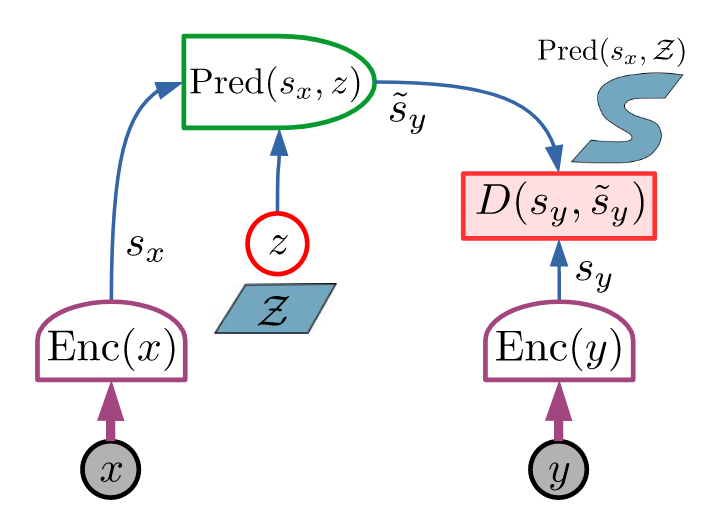
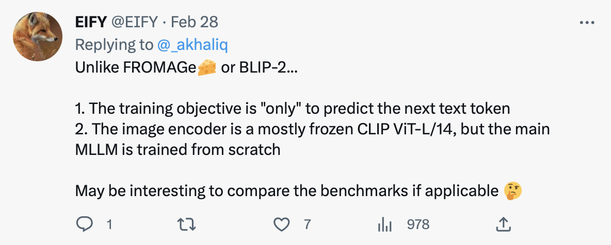

## tl;dr
One skimming session. 

## Context
- Fresh out of latent diffusion, @rombachHighResolutionImageSynthesis2022. Dig deeper. 
- Doom scrolling AI twitter is not productive. If you are going to fragment the attention, doom skimming papers is better. Just keep the most productive hour for concentrated work without fragmentation.

## Done
The largest skimming festival I've ever have LoL.

## Learned
- [hypothesize -> `co-occurrence` and `causality in time` are enough to bootstrap multimodal intelligence.] 
- [lesson_learned]
  - I can skim. Doom skimming papers should be more productive than doom scrolling AI twitter.
  - Skimming helps to understand what you don't want or need. Deep reading hones your taste, which is the foundation to understand what you want. 
  - Skimming is like eating, which is more productive when you are hungry with empty stomach.
  - Easting is just part of the story, digest is important. 
  - Forced skimming is like eating when you are full, more like hording. Don't do that. Stop skimming and start coding when you are full. Choose project wisely and dig in. Coding is digesting.

## Next?
Back to code. 

## Log
- [skim(@pfeifferModularDeepLearning2023) -> _full_read]
  - 
  - Judged by the abstract and the conclusion, the paper easily reaches full reading status. 
  - Was studying `PEFT` and thinking about adaptor to enable multimodal model with frozen backbones. 
  - Black box, 1 model to rule them all is great but to realize decentralized AI, modular AI is essential.
- [skim(@liTrainLargeThen2020)]
  - "We show that increasing model width and depth accelerates convergence in terms of both gradient steps and wall-clock time. Moreover, even though large models appear less efficient during inference, we demonstrate that they are more robust to compression. Therefore, we conclude that the best strategy for resource constrained training is to train large models and then heavily compress them."
  - Like a baby has 100b neurons at birth and gradually pruning them growing up to adopt.
  - I'm more interested in task oriented distillation, or LLM supervision as in @baiConstitutionalAIHarmlessness2022.
- [skim(@merulloLinearlyMappingImage2022)]
  - "image representations from vision models can be transferred as continuous prompts to frozen LMs by training only a single linear projection."
  - "such transfer is highly dependant on the amount of linguistic supervision the image encoder backbone had during its pretraining phase. BEIT, which is a vision-only image encoder under performs compared to CLIP, which was pretrained with natural language captions."
    - `Linguistic supervision`  is artificial co-occurrence of language and vision.
    - [hypothesize -> `co-occurrence` and `causality in time` are enough to bootstrap multimodal intelligence.] 
      - Maybe we don't need that much of language supervision after all. Language supervision per modality is too hard and inefficient. CLIP is hard enough, how do you label every modality with natural language at scale?
      - You don't want to map every modality to language and use language as glue to connect them. That may work but too much work. Language is one modality. 
      - Randomly initialized NN doesn't inherit evolutionary learnings, hence pretraining is still necessary to bootstrap single modality.
      - `JEPA`: co-occurring multimodal patterns are inputs. Causality in time to choose prediction target. 
      - Sporadic language supervision would be enough to generalize across the whole multimodal space. Not everything could be described and instructed by language and that's ok. Think about labeling golf swing. 
      - @nagraniAttentionBottlenecksMultimodal2022 or JEPA, @lecunPathAutonomousMachine2022, which one is the proper glue?
  - "Our findings indicate that large LMs do appear to form models of the visual world along these perceptual concepts to some extent, but are biased to form categorical concepts of words that are not distinguished by vision only models."
  - [soliloquy]
    - It's not LM learns the model of visual world. The same natural pattern could be captured by language and pixels. Effective representation learning, be it language or vision based, could project those patterns in latent space. 
    - What's more interesting is one **linear transformation** is enough to bridge language only and vision only latent space. This is new and deep to me. 
    - Linear transformation is literally like change the view point of a 3d video game. Meaning, well learning vision and language latent space live in the same coordinate system. All you need is a change of perspective.
    - However, CLIP is contrastive. I don't know how many language annotations for images are enough to carve out the complete joint latent space. `Yann` doesn't believe in contrastive learning though.
- [skim(@huangComposerCreativeControllable2023) -> _digging]
  - "decompose an image into representative factors, and then train a diffusion model with all these factors as the conditions to recompose the input."
  - This is very `functa`. Like semantic PCA and use them as levers for control.
- Let's find out how many paper I could skim this morning. Maybe skimming is not effective strategy for me because I'm too ignorant right now. Value/token is high regardless what I read. Maybe me filtering Twitter AI to create skim pool is skimming already. 
- [skim(@huangLanguageNotAll2023) -> _full_read]
  - The paper cites `Wittgenstein` at the first line. I'm sold. 
  - 
  - I'm studying `FROMAGe` and `BLIP-2` already. Great to complete the trio. Maybe I should finish this track first before reading any more multimodal paper. 
- [skim(@wortsmanModelSoupsAveraging2022)]
  - "fine-tuned models often appear to lie in a single low error basin"
  - " We show that averaging the weights of multiple models finetuned with different hyperparameter configurations often improves accuracy and robustness."
  - The basin is interesting idea but I don't think parameter sweeping is the best way to use flops, even in distributed setting.
  - Adapter and LoRA are more controllable and elegant. Full model finetuning and merging is overkill. 
  - The basin... is the common ground to make param merging meaningful.
- [skim(@changMuseTextToImageGeneration2023) -> _full_read]
  - Apply masked modeling in latent space. 
  - Pretrained text encoder + VQGAN tokenizer. 
  - I'm mostly interested in the image tokenizer. The paper showed MLM is good enough. Diffusion is not necessary. Simplifies the whole pipeline centered around transformer.
- [skim(@rebuffiLearningMultipleVisual2017)]
- [skim(@zhangAddingConditionalControl2023) -> _digging]
  - "Stable Diffusion can be augmented with ControlNets to enable conditional inputs like edge maps, segmentation maps, keypoints, etc. This may enrich the methods to control large diffusion models and further facilitate related applications."
  - An adapter architecture to fuse extra info as control signal to image generation pipeline. It could apply to diffusion. I believe it could apply to Muse as well. 
- [skim(@huangLanguageModelsZeroShot2022) -> _full_read]
  - This is grounded decision making: "find that if pre-trained LMs are large enough and prompted appropriately, they can effectively decompose high-level tasks into mid-level plans without any further training." Hierarchical RL by LLM. 
  - Very important to teach LLM to use tools. 
- [skim(@aghajanyanScalingLawsGenerative2023) -> _full_read]
  - "model the optimal synergy and competition due to data and model size as an additive term to previous uni-modal scaling laws."
  - This paper is perfect theoretical companion to @huangLanguageNotAll2023. Read them together to see the tree and the forest.
- [skim(@zhangWisdomHindsightMakes2023)]
  - "converting feedback to instruction by relabeling the original one and training the model for better alignment in a supervised manner."
  - The idea is interesting. Whether RL is necessary for alignment is active debates. But I'm far from caring HHH right now. Skip for now. 
- [skim(@diaoActivePromptingChainofThought2023)]
  - "we propose a solution to the key problem of determining which questions are the most important and helpful ones to annotate from a pool of taskspecific queries. By borrowing ideas from the related problem of uncertainty-based active learning, we introduce several metrics to characterize the uncertainty so as to select the most uncertain questions for annotation."
  - Interested in quantifying uncertainty in LLM.
  - I think prefix tuning and `<work>` token in pretraining would be more useful than hard prompt optimization. 
- [skim(@sunHowDoesInContext2023)]
  - "(1) IPT does not always outperform PT, and in fact requires the in-context demonstration to be semantically similar to the test input to yield improvements; (2) PT is unstable and exhibits high variance, but combining PT and ICL (into IPT) consistently reduces variance across all five tasks; and (3) prompts learned for a specific source task via PT exhibit positive transfer when paired with in-context examples of a different target task."
  - Direct expansion to `MedPaLM`'s IPT. But how can UMASS do research on IPT?
  - "We experiment with the BLOOM1.1B, OPT-1.3b, and GPT-2-XL-1.5B models on all our tasks."
  - This choice basically renders the whole paper useless. Too bad I love to learn more about IPT.
  - The same research could be redone with LLaMA 65b. 
- [skim(@silPrimeQAPrimeRepository2023)]
  - The [repo](https://github.com/primeqa/primeqa) could definitely boost my QA related research and it's based on HF. Good choice. Thanks IBM. 
- [skim(@hamModulatingPretrainedDiffusion2023)]
  - "MCM is a small module trained to modulate the diffusion network’s predictions during sampling using 2D modalities (e.g., semantic segmentation maps, sketches)"
  - Another adapter to diffusion for fine grained control. 
  - Text plus 2d control signal to diffusion is the instruction finetuning moment of image generation pipeline. However I'll keep control net as first contact of this track. One is enough. Sorry. 
- [skim(@pengCheckYourFacts2023) -> _digging]
  - From Microsoft. I should pay extra attention to ChatGPT related research from Microsoft since they have first class access to such model. 
  - "Our system makes the LLM generate responses grounded in consolidated external knowledge, e.g., stored in task-specific databases. It also iteratively revises LLM prompts to improve model responses using feedback generated by utility functions, e.g., the factuality score of a LLM-generated response."
  - Right paper for anyone who is interesting to use `ChatGPT api` to build anything. 
- [skim(@karamchetiLanguageDrivenRepresentationLearning2023) -> _digging]
  - "masked autoencoding approaches pick up on low-level spatial features at the cost of high level semantics, while contrastive learning approaches capture the opposite"
  - "We then introduce Voltron, a framework for languagedriven representation learning from human videos and associated captions. Voltron trades off language-conditioned visual reconstruction to learn low-level visual patterns, and visually-grounded language generation to encode high-level semantics."
  - Isn't this the holy grail of multimodal learning? Learning from video and sparse language supervision. 
- [skim(@weiELITEEncodingVisual2023)]
  - Global and local network to deal with semantic and low level visual details? 
  - Again, another adapter for image gen control. 
- [skim(@ansellComposableSparseFineTuning2022) -> _full_read]
  - "Adapters are modular, as they can be combined to adapt a model towards different facets of knowledge (e.g., dedicated language and/or task adapters). Sparse finetuning is expressive, as it controls the behavior of all model components."
  - "Unlike adapter-based fine-tuning, this method neither increases the number of parameters at inference time nor alters the original model architecture. Most importantly, it outperforms adapters in zero-shot cross-lingual transfer by a large margin in a series of multilingual benchmarks"
  - Ok definitely need to know more abut sparse finetuning. Very good extension paper to @pfeifferModularDeepLearning2023.
- [soliloquy -> I feel sparse finetuning is better than adapter. Reuse the dead zone in the pretrained model. Why bother adding architectures? Like dead neurons are not removed, and revival to adapt to new tasks.]
- [skim(@andreasNeuralModuleNetworks2017) -> _digging]
  - "We propose an evolutionary method capable of generating large scale multitask models that support the dynamic addition of new tasks." Sold. Hahaha. 
  - Would love to learn more about evo algo. 
- [skim(@gesmundoMultiagentFrameworkAsynchronous2022) -> _digging]
  - Have all the keywords I'm interested. Multiagent, collaboration, asynchronous extension of dynamic large scale multitask systems.
- [skim(@gesmundoMultipathAgentsModular2023) -> _full_read]
  - `munet`. Read this in full to decide of this is the right niche to put more efforts into. 
- [skim(@asaiATTEMPTParameterEfficientMultitask2022)]
  - Self attention on soft prompts to achieve multitask transfer learning. Very fancy. However I'm not in a position to do prefix finetuning so skip for now. 
- [soliloquy -> not interested in multilingual application for now. It's special case of multitask learning. Not every task has such clear cut.]
- [skim(@kasirzadehConversationArtificialIntelligence2022) -> _digging]
  - "train the AI system to build a causal model of itself. We develop an instance of this solution for Deep RL agents: Causal Self-Talk. CST operates by training the agent to communicate with itself across time."
  - Self-talk is critical for calibration. Dig in. 
- [skim(@songConsistencyModels2023a)]
  - "support fast one-step generation by design, while still allowing for few-step sampling to trade compute for sample quality."
  - Great to reaffirm that all in current diffusion is not necessary.
- [skim(@dehghaniScalingVisionTransformers2023)]
  - "present a recipe for highly efficient and stable training of a 22B-parameter ViT"
  - ViT pretraining is beyond me. Learn how to use existing ViT is more important.
- [skim(@wangKAdapterInfusingKnowledge2021)]
  - "K-ADAPTER has a neural adapter for each kind of infused knowledge, like a plug-in connected to RoBERTa. There is no information flow between different adapters, thus multiple adapters can be efficiently trained in a distributed way."
  - Knowledge cassette. Interesting. 
- [lesson_learned]
  - I can skim. Doom skimming papers should be more productive than doom scrolling AI twitter.
  - Skimming helps to understand what you don't want or need. Deep reading hones your taste, which is the foundation to understand what you want. 
  - Skimming is like eating, which is more productive when you are hungry with empty stomach.
  - Easting is just part of the story, digest is important. 
  - Forced skimming is like eating when you are full, more like hording. Don't do that. Stop skimming and start coding when you are full. Choose project wisely and dig in. Coding is digesting.
- I'm ready to stop right here. 