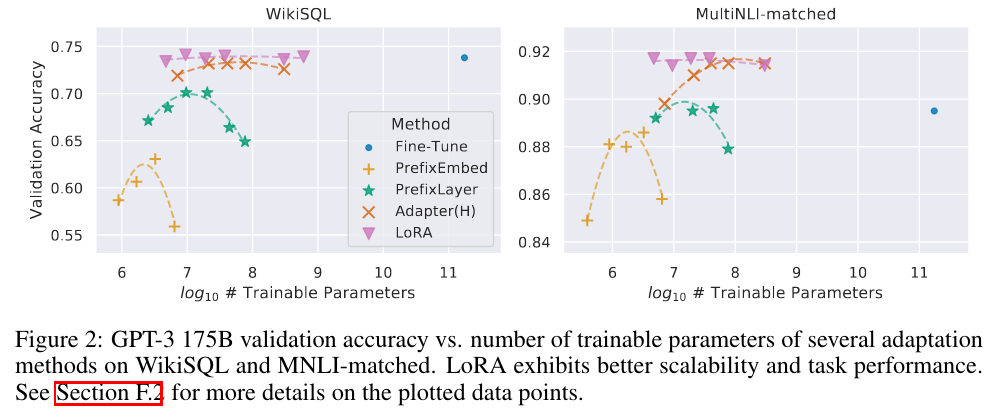

## tl;dr
- No special magic with PEFT. LLM could be prompt tuned because the base model is already capable. Smaller NN could be LoRAed, which is a smart and efficient method, but the capability is still capped by the base model. The search for right application for solo friendly model size (<11b) is still on. Stable diffusion and its LoRAed variations are good examples.

## Context
- Preparing for `lesterPowerScaleParameterEfficient2021` project. 

## Done
- Played with int8 LoRA finetuning t5 model and int8 inference.
- Read few related background papers. 

## Learned
- [lesson_learned]: Pay extra attention to too good to be true paper. First `mm-cot` then this. Glad I'm immune after 2 shots. 

## Next?
- Is LoRA enough for instruction finetuning? 
  - [critique]: following instruction is very basic property that warrant a full model finetuning. Even LoRA could match the performance, LoRA weight would be like permanently merged with pretrained model. Makes no difference to finetune a full model.


## Log
- [code(8bit lora training and inference with flan-t5)]
  - memory footprint:
    - large, 2m32s, 3.31g cuda memory during training, single card, adaptor size 19mb
    - xl, 3m32s, 6.91g, 37.9mb
    - xxl, 7m52s, 20g, 75.6mb
    - It's amazing that I could adapt a t5 xxl model with 1 card.
  - 8bit inference of that lora model didn't work.
    ```python
      /usr/local/lib/python3.8/dist-packages/bitsandbytes/functional.py:1698 in transform              │
    │                                                                                                  │
    │   1695                                                                                           │
    │   1696                                                                                           │
    │   1697 def transform(A, to_order, from_order='row', out=None, transpose=False, state=None, ld=N  │
    │ ❱ 1698 │   prev_device = pre_call(A.device)                                                      │
    │   1699 │   if state is None: state = (A.shape, from_order)                                       │
    │   1700 │   else: from_order = state[1]                                                           │
    │   1701 │   if out is None: out, new_state = get_transform_buffer(state[0], A.dtype, A.device, t  │
    ╰──────────────────────────────────────────────────────────────────────────────────────────────────╯
    AttributeError: 'NoneType' object has no attribute 'device'
    ```
  - `os.environ["CUDA_VISIBLE_DEVICES"] = "0"` is ignored in 8bit inference.  
  - Can't even get single card, `load_in_8bit` work as expected. Feel like fighting the framework. The api is not clear and waste time try and error to get the framework to behave as expected. It should be more controllable to deal with `mixed precision` training, `int8` inference and `PEFT`. Very frustrated.
- [file_github_issue(int8 inference didn't work with LoRA on T5) -> https://github.com/huggingface/peft/issues/115]
  - Turns out, as always. Part of my stupidity and part of something I don't know. Need to learn more about `int8` inference and its HF integration.
- [read([Mosaic's fp8 support](https://github.com/mosaicml/composer/pull/1965))]
  - Would get a 4090 if fp8 or bf8 is possible. 
- [read([LoRA](https://arxiv.org/abs/2106.09685))]
  - I like it didn't use context window, and the LoRA modules could be fused to host model with no extra inference cost.
  - With increasing r, LoRA is approximating the full finetuning. 
  - Very clever and efficient way to change the model. 
  - In theory, prompt tuning can't match LoRA's performance? Why did `MedPaLM` choose prompt tuning? To avoid overfitting and keep Flan-PaLM's generality? 
  - 
    - I feel, for small model, one could just give up prompt tuning. Should go straight to LoRA. Just have to sacrifice generality for targeted performance. 
    - Plus you don't want to hyperparam search n for max prompt tuning performance, per task? LoRA is more parameter tolerant, at least from what is shown in the paper. 
    - Adaptor is more for modality fusion. 
  - Apply to `[q, v]`, `r=8` is good starting point. The update matrix ∆W could have a very small “intrinsic rank”. Chasing large r is waste of resource. 
- [read([On the Effectiveness of Parameter-Efficient Fine-Tuning](http://arxiv.org/abs/2211.15583))]
  > we show that all of the methods are actually sparse fine-tuned models and conduct a novel theoretical analysis of them. We indicate that the sparsity is actually imposing a regularization on the original model by controlling the upper bound of the stability. Such stability leads to better generalization capability which has been empirically observed in a lot of recent research works.
  - If PEFT is applying sparsity as regulation, then current PEFT like prompt tuning or LoRA are process of manufacturing manual sparsity per task. I see mixture of expert as a way to fully automate the process.
  - However, having a LoRA module, or a specific soft prompt do help interpretability though. 
- [read([HF PEFT library caveats section](https://github.com/huggingface/peft#caveats))]:
  > For encoder-decoder models, P_TUNING or PROMPT_TUNING doesn't support generate functionality of transformers because generate strictly requires decoder_input_ids but P_TUNING/PROMPT_TUNING appends soft prompt embeddings to input_embeds to create new input_embeds to be given to the model. Therefore, generate doesn't support this yet.
  - LoRA and p-tuning v2 are more T5 friendly for now. Prompt tuning is more suitable for decoder only LLM.
- [retrieve([MedPaLM](http://arxiv.org/abs/2212.13138))]
  > Because LLMs have grown to hundreds of billions of parameters, finetuning them is extraordinarily computationally expensive. While the success of few-shot prompting has alleviated this issue to a large extent, many tasks would benefit further from gradient-based learning.
    - At 540b scale, finetuning is not necessary for new task. It has seen them all Orz. Prompt tuning is chosen to automate prompt engineering for medical application. Like besides following instruction(done with flan finetuning), be logical and reasonable(CoT, SC), talk like a doctor could be done either with prompt engineering, or with prompt tuning. [Do you concur?](https://www.youtube.com/watch?v=qyngj0M-LQk&t=2s)
  > While prompt tuning can benefit from any number of labeled examples, typically only a handful of examples (e.g., tens) are required to achieve good performance.
    - No need to curate large finetuning dataset. 
  > ... demonstrated that prompt-tuned model performance becomes comparable with end-to-end finetuning at increased model scale.
    - LLM is more promptable that LoRA or adaptor PEFT are overkill.
    - For small model, prompt tuning performance is not good, and the hyperparam sensitive, those drawbacks are gone with LLM? In scaling and bitter lesson perspective, LoRA is premature optimization?
    - The paper didn't even mention LoRA.
  > Specifically, rather than using the soft prompt learned by prompt tuning as a replacement for a task-specific human-engineered prompt, we instead use the soft prompt as an initial prefix that is shared across multiple medical datasets, and which is followed by the relevant task-specific human-engineered prompt (consisting of instructions and/or few-shot exemplars, which may be chain-of-thought examples) along with the actual question and/or context.
    - It's a learned meta conditioner for medical application. The old recipe instruction + few shot + CoT + SC is still there.
    - The base model is Flan-PaLM, so those hard prompts are easier for human to change and tweak. Also helps with interpretability.
    - Flan-PaLM showed zero shot CoT performance already. Humanly curated CoT here is tailored to medical application. Since few shot is enough for LLM to adopt, manual curation is even cheaper than prompt tuning.
  > Given the combination of soft prompt with hard prompt, instruction prompt tuning can be considered a type of "hard-soft hybrid prompt tuning", alongside existing techniques that insert hard anchor tokens into a soft prompt, insert learned soft tokens into a hard prompt, or use a learned soft prompt as a prefix for a short zero-shot hard prompt. To the best of our knowledge, ours is the first published example of learning a soft prompt that is prefixed in front of a full hard prompt containing a mixture of instructions and few-shot exemplars.
    - Natural language as interface to large scale computation power. This line between hard and soft prompt is UI/UX design. What should be automated and put behind the scene, what should be exposed.
- [read([P-tuning v2](http://arxiv.org/abs/2110.07602))]
  - I have a bad feeling about this paper. Hopefully it's my stupidity.
  > ... for medium-sized models (from 100M to 1B) that are widely used, prompt tuning performs much worse than fine-tuning.
  >
  > Though Lester et al. (2021); Liu et al. (2021) have shown superiority on some of the NLU benchmarks, the effectiveness of prompt tuning on hard sequence tagging tasks is not verified.
  >
  > In our experiments (Cf. Section 4.2 and Table 3), we show that Lester et al. (2021); Liu et al. (2021) perform poorly on typical sequence tagging tasks compared to fine-tuning.
    - Prompt tuning changes how input is processed. The base model is fixed. This is by design.
      - Learned soft prompt may perform better than human curated hard prompt. The ceiling is still capped by base model. What performance do you expect from <1b model?
      - Lester is more interested in fixed base model because Google is dealing with PaLM, not deberta.
    - NLU is proved to be hard for small model. Semantic understanding comes with scale. 
  
  > (on soft prompt): First, the number of tunable parameters is limited due to the constraints of sequence length. Second, the input embeddings have relatively indirect impact on model predictions.
    - This is not a problem statement. That is by design. The goal from Lester is DO NOT CHANGE base model. 
  > (ptv2): prompts in different layers are added as prefix tokens. On one hand, P-tuning v2 have more tunable task-specific parameters (from 0.01% to 0.1%-3%) to allow more per-task capacity while being parameter-efficient; on the other hand, prompts added to deeper layers have more direct impact on model predictions.
    - There are many ways to change the base function. The title is totally misleading because this is not prompt method anymore. It's more LoRA than prompt tuning. 
    - Lack of tunable parameters is not a problem, but a feature. The hope is adapt base LLM to resource constrained task as efficiently as possible.
  - I'll stop reading here. That fact this paper didn't even cite LoRA is a big red flag. It's comparing function changing finetuning to prompt only PEFT. What a shame.
- [lesson_learned]: Pay extra attention to too good to be true paper. First `mm-cot` then this. Glad I'm immune after 2 shots. 
- [soliloquy]
  - Now I understand why people flock to LoRA stable diffusion. Image generation is 1) more close to production quality 2) small model friendly 3) easier to see the difference. Therefore it's more LoRA worthy. 
  - Easier to LoRA a studio ghibli SD model and maybe find your audience and application, but what's the purpose of LoRAed small LM?
  - character.ai is a good use of LoRAed small LM. Basically you need to find something to conditioned on that creates values. General small LM is not feasible now. General LM will remain a capital game for foreseeable future. 
- [return(lesterPowerScaleParameterEfficient2021)]
