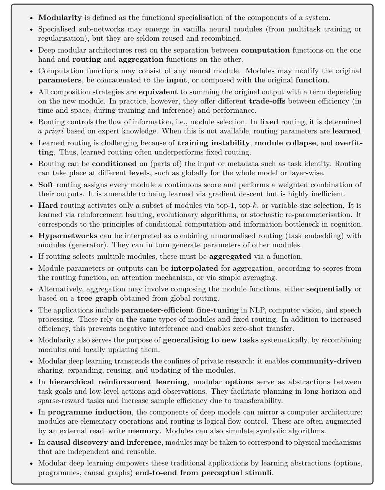
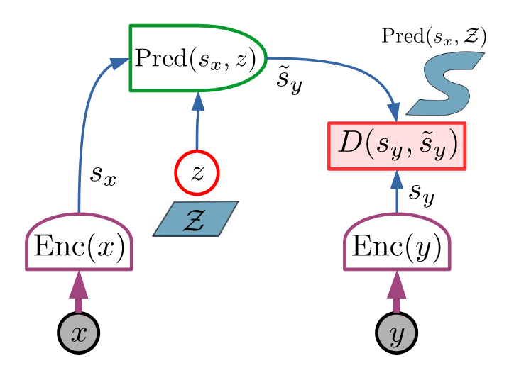
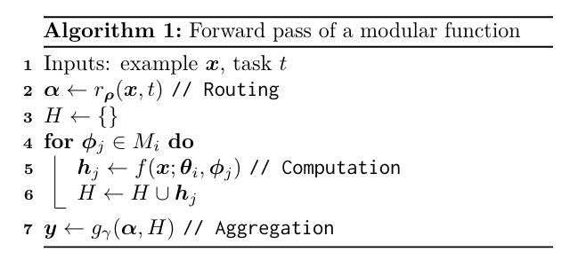
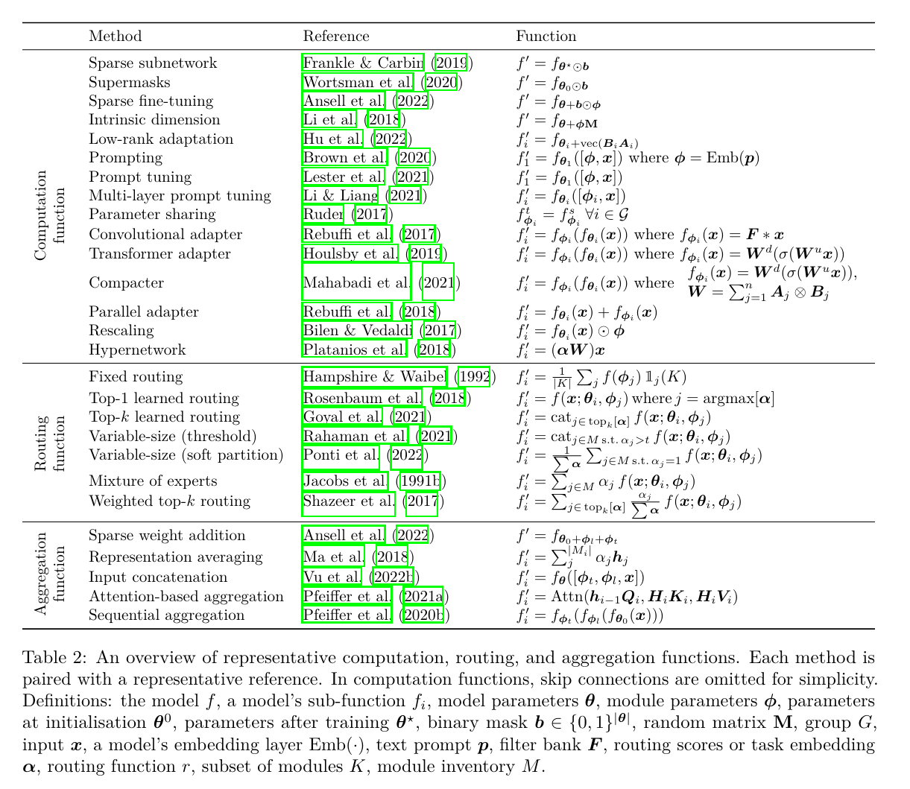

## tl;dr
Typical paper reading session.

## Context
- Fresh out of latent diffusion, @rombachHighResolutionImageSynthesis2022. Dig deeper. 
- Doom scrolling AI twitter is not productive. If you are going to fragment the attention, doom skimming papers is better. Just keep the most productive hour for concentrated work without fragmentation.

## Done

## Learned

## Next?

## Log
- [skim(@pfeifferModularDeepLearning2023)]
  - 
  - Judged by the abstract and the conclusion, the paper easily reaches full reading status. 
  - Was studying `PEFT` and thinking about adaptor to enable multimodal model with frozen backbones. 
  - Black box, 1 model to rule them all is great but to realize decentralized AI, modular AI is essential.
- [skim(@liTrainLargeThen2020)]
  - "We show that increasing model width and depth accelerates convergence in terms of both gradient steps and wall-clock time. Moreover, even though large models appear less efficient during inference, we demonstrate that they are more robust to compression. Therefore, we conclude that the best strategy for resource constrained training is to train large models and then heavily compress them."
  - Like a baby has 100b neurons at birth and gradually pruning them growing up to adopt.
  - I'm more interested in task oriented distillation, or LLM supervision as in @baiConstitutionalAIHarmlessness2022.
- [skim(@merulloLinearlyMappingImage2022)]
  - "image representations from vision models can be transferred as continuous prompts to frozen LMs by training only a single linear projection."
  - "such transfer is highly dependant on the amount of linguistic supervision the image encoder backbone had during its pretraining phase. BEIT, which is a vision-only image encoder under performs compared to CLIP, which was pretrained with natural language captions."
    - `Linguistic supervision`  is artificial co-occurrence of language and vision.
    - [hypothesize -> `co-occurrence` and `causality in time` are enough to bootstrap multimodal intelligence.] 
      - Maybe we don't need that much of language supervision after all. Language supervision per modality is too hard and inefficient. CLIP is hard enough, how do you label every modality with natural language at scale?
      - You don't want to map every modality to language and use language as glue to connect them. That may work but too much work. Language is one modality. 
      - Randomly initialized NN doesn't inherit evolutionary learnings, hence pretraining is still necessary to bootstrap single modality.
      - `JEPA`: co-occurring multimodal patterns are inputs. Causality in time to choose prediction target. 
      - Sporadic language supervision would be enough to generalize across the whole multimodal space. Not everything could be described and instructed by language and that's ok. Think about labeling golf swing. 
      - @nagraniAttentionBottlenecksMultimodal2022 or JEPA, @lecunPathAutonomousMachine2022, which one is the proper glue?
  - "Our findings indicate that large LMs do appear to form models of the visual world along these perceptual concepts to some extent, but are biased to form categorical concepts of words that are not distinguished by vision only models."
  - [soliloquy]
    - It's not LM learns the model of visual world. The same natural pattern could be captured by language and pixels. Effective representation learning, be it language or vision based, could project those patterns in latent space. 
    - What's more interesting is one **linear transformation** is enough to bridge language only and vision only latent space. This is new and deep to me. 
    - Linear transformation is literally like change the view point of a 3d video game. Meaning, well learning vision and language latent space live in the same coordinate system. All you need is a change of perspective.
    - However, CLIP is contrastive. I don't know how many language annotations for images are enough to carve out the complete joint latent space. `Yann` doesn't believe in contrastive learning though.
- [skim(@huangComposerCreativeControllable2023)]
  - "decompose an image into representative factors, and then train a diffusion model with all these factors as the conditions to recompose the input."
  - This is very `functa`. Like semantic PCA and use them as levers for control. Worth digging. 
- [read(@pfeifferModularDeepLearning2023)]
  - To achieve positive transfer, compositionality, and parameter efficiency, one needs to understand modules, routing function and aggregation function.
  - Key dimensions: 
    1. how they implement modules, which constitute the minimum unit of computation; 
      - adapter
      - sparse sub-networks, ex: LoRA
      - prefix tuning, ex: Lester prompt tuning
    2. how they select active modules through a routing function; 
    3. how module outputs are aggregated;
    4. how the modules are trained with the rest of the model.
  - [soliloquy]
    - These module implementations are great reaffirmation of my previous understanding about `level of change`, they offer different trade-offs between efficiency and performance. I'm literally learning means of combination of nn modules.
    - Total ignorance to routing function. 
    - Aggregation function is interesting. Functional decomposition and composition come to mind, as in @huangComposerCreativeControllable2023 and @dupontDataFunctaYour2022. 
    - Integration of pretrained frozen model is my top favorite. I see a future to propagate level of change wrt to different computation budget. 
      - `Prefix tuning` may be the cheapest entry point. Instead of manual prompt engineering, local task adaptation by prefix tuning to local dataset is efficient, privacy preserving and autonomous.
      - LoRA adapter is the next step.
      - Finetuning adapter is more expensive. 
      - Design and train a new adapter is even more expensive.
      - Pretraining a new module will remain to the selected few. Like everyone needs energy but impossible for everyone to mine the oil and refine it.
  - Modular, multimodal and multitool model are all related. [question -> what is the proper API to construct such system?] This question takes me back to the good old days of Scala actor model. 
  - 
    - Means of combination between base model param and module param. 
      - parameter composition
      - input composition
      - function composition
  - 
    - This is crazy. Such simple algorithm and notations could explain many modular DL patterns. What a good mental framework!
  - The paper is very complimentary to @mialonAugmentedLanguageModels2023, which considers function and this one is about form. Together, they are the two sides of the same coin.
  - 