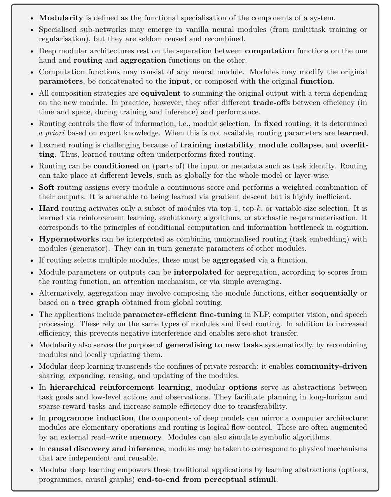

## tl;dr
Typical paper reading session.

## Context
- Fresh out of latent diffusion, @rombachHighResolutionImageSynthesis2022. Dig deeper. 
- Doom scrolling AI twitter is not productive. If you are going to fragment the attention, doom skimming papers is better. Just keep the most productive hour for concentrated work without fragmentation.

## Done

## Learned

## Next?

## Log
- [skim(@pfeifferModularDeepLearning2023)]
  - 
  - Judged by the abstract and the conclusion, the paper easily reaches full reading status. 
  - Was studying `PEFT` and thinking about adaptor to enable multimodal model with frozen backbones. 
  - Black box, 1 model to rule them all is great but to realize decentralized AI, modular AI is essential.
- [skim(@liTrainLargeThen2020)]
  - "We show that increasing model width and depth accelerates convergence in terms of both gradient steps and wall-clock time. Moreover, even though large models appear less efficient during inference, we demonstrate that they are more robust to compression. Therefore, we conclude that the best strategy for resource constrained training is to train large models and then heavily compress them."
  - Like a baby has 100b neurons at birth and gradually pruning them growing up to adopt.
  - I'm more interested in task oriented distillation, or LLM supervision as in @baiConstitutionalAIHarmlessness2022.
- [skim(@merulloLinearlyMappingImage2022)]
  - "image representations from vision models can be transferred as continuous prompts to frozen LMs by training only a single linear projection."
  - "such transfer is highly dependant on the amount of linguistic supervision the image encoder backbone had during its pretraining phase. BEIT, which is a vision-only image encoder under performs compared to CLIP, which was pretrained with natural language captions."
  - "Our findings indicate that large LMs do appear to form models of the visual world along these perceptual concepts to some extent, but are biased to form categorical concepts of words that are not distinguished by vision only models."
  - [soliloquy ->]
    - It's not LM learns the model of visual world. The same natural pattern could be captured by language and pixels. Effective representation learning, be it language or vision based, could project those patterns in latent space. 
    - What's more interesting is one **linear transformation** is enough to bridge language only and vision only latent space. This is new and deep to me. 
    - Linear transformation is literally like change the view point of a 3d video game. Meaning, well learning vision and language latent space live in the same coordinate system. All you need is a change of perspective.
    - However, CLIP is contrastive. I don't know how many language annotations for images are enough to carve out the complete joint latent space. `Yann` doesn't believe in contrastive learning though.
- [skim(@huangComposerCreativeControllable2023)]
  - "decompose an image into representative factors, and then train a diffusion model with all these factors as the conditions to recompose the input."
  - This is very `functa`. Like semantic PCA and use them as levers for control. Worth digging. 