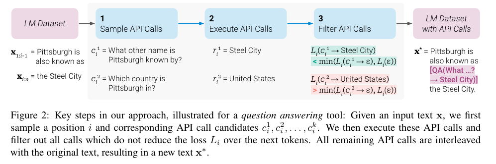

## tl;dr

## Context
Coming from `lesterPowerScaleParameterEfficient2021`. Choose next project by reviewing following ideas:
- [ ] `aoSpeechT5UnifiedModalEncoderDecoder2022`, intro to adaptor based multimodal, (audio, text).
- [ ] `rombachHighResolutionImageSynthesis2022`, LoRA stable diffusion, intro to multimodal, (image, text). 
- [ ] `schickToolformerLanguageModels2023`, LoRA LM to use tools. 
- [ ] `longpreFlanCollectionDesigning2023`, LoRA instruction finetuning. Coding practice for data engineering, LoRA ft and evaluation.
- [ ] Learn t5x and figure out how to make prompt tuning work on t5: training, inference and evaluation. 

## Done

## Learned

## Next?

## Log
- [read([Toolformer: Language Models Can Teach Themselves to Use Tools](https://arxiv.org/abs/2302.04761v1))]
  - 
    - This is interesting. Say the pretrained model can't get this answer right, "Pittsburgh is also known as", but an API call, [QA() -> Steel City] actually reduce the loss, which means this call did help the model to fit the data better. 
    - Then we finetune the model with API call. Next time model see "Pittsburgh is also known as", the probability of next few tokens be "[QA()..." would be higher. The model learns to call API now. 
    - Of course this depends on the quality of few-shot generated sudo API annotation data is. Like a distilling process. Could be iterative.
    - Filter by loss reduction is actually a good idea. No need to train another BERT as filter or use RLHF, which requires collecting preference data plus unstable RL training.
  - Each tool is a `text2text` function, which could be a LoRAed model or non-differentiable tool such as python interpreter. 
  - [eureka -> ideally, reuse the same base model, flan-t5-xxl maybe. The whole orchestra is a LoRA ensemble. Training data could be generated from other LLM and filtered by the decision making model. This may alleviate the bootstrapping pressure.]
    - Similar to the hydra architecture from Sparrow, but for the poor LoL. 
    - `Yejin Choi`'s lab [has many distilling researches](https://homes.cs.washington.edu/~yejin/). 
    - Need to figure out how to effectively use `davinci` to generate training data. Don't want to use it to scan the whole pretraining dataset. 
  - If the API call didn't reduce the loss, probably the model got it right without using tool. Human doesn't have to manually engineer the line between calling API and not. 
    - The methodology applies to different base model. Weaker base model may need to use more tools more often than the strong one. 
    - Hopefully, with tools, the weaker, smaller model could still perform decently. [lesson_learned -> This line of research is essentially designing the bicycle for LM. Ability to use and invent tools is how human break out of natural physical limitation.]
  - [eureka -> LLM reflection: inspired by how `toolformer` chooses where to insert API call. LLM first generates a paragraph. Review to decide if using more tools could improve the answer. Execute and improve on previous generation. The beauty of reflection is not simply throwing more computation for text generation and redundant API calls, but to use the whole context. Pretrain the model with `FIM`. During the reflection, give LLM the whole context, before and after the breakpoint, to help it decide whether to use extra tool for further improvement. This is similar to human making a draft and iterate. The process of editing draft is a lot of `FIM`, rather than repeated autoregressive generations.]
  - [question -> funny to realize LM has no sense of time. Space and time are deepest inductive biases of human. Wondering what AI could learn if it could switch them on and off at will? Must be very liberating? Scary maybe.]
  - [question -> `opt` has a 6.7b variation. Why did meta use GPT-J?]
  - "We let the model start an API call not just when <API> is the most likely token, but whenever it is one of the k most likely tokens. For k = 1, this corresponds to regular greedy decoding; we instead **use k = 10** to increase the disposition of our model to make use of the APIs that it has access to."
    - Like, when in doubt, call API. 
    - This could be very good learning signal. Few simple examples
      -  `->` is top 1 but the result after API call is bad: the API module is bad or the decision to call API is bad. 
      -  `->` is not even in the top 30, but the result is bad: improve decision making model. Learn to call help when needed. 
      -  `->` is at 15th. The model is not sure whether to ask for help. Collect and analyze these indecisive cases. You may find a pattern like 80% is about using calculator. May need to find better heuristics to generate calculator training data. Or even introduce human labeler like hiring a tutor for specialized subject learning. Then finetune further. 
 - Eval on `LAMA`
   - "This is achieved because the model independently decides to ask the question answering tool for the required information in almost all cases (98.1%); for only very few examples, it uses a different tool (0.7%) or no tool at all (1.2%).
   - Retrieval works on knowledge intensive task, especially for small model. The value of this paper is learning to make use of tools. Not proving retrieval is useful. 
   - With 98.1% call rate, the model is well trained to know it need helps on this type of work.
 - Eval on math
   - "This is because across all benchmarks, for 97.9% of all examples the model decides to ask the calculator tool for help."
   - Small model can't do math. Call for help works.
 - Eval on QA. This requires knowledge, commonsense and logic. 
   - "mostly relying on the Wikipedia search API (99.3%) to find relevant information."
   - Not performing well compare to GPT-3. 
 - [soliloquy ->]
   - Informed, correct QA is prerequisite for informed decision, which is prerequisite for informed action. 
   - Logic, commonsense, knowledge and be able to do simple math are prerequisite for informed QA.
   - 6b tool equipped LM can't do informed QA as well as GPT-3. There is more work to do. This first version bicycle is not good.
 - [soliloquy -> ]
   - `toolformer` can't trigger multiple tools at the same time. One may need to fork every help asking moment and teach AI to run an iterative research loop. One function call with one tool is not enough. 
   - Using tool shouldn't be treated as trigger with next token. Human decompose a task, make init research plan and iterate. I would be very myopic to write a sentence and trigger search linearly ad hoc. Even though I'm typing this sentence linearly, the whole idea is in my brain the whole time. Typing is just idea serialization process. 
   - That process is more aligned to encoder-decoder architecture. Gather some input, even recall previous ideas, produce a high level fused idea embedded in the high dim vector space. Then use that vector to condition a decoder with cross attention to generate the output. 
   - `attention is all you need` is a prior too strong that I don't know it's a bliss or a curse.
 - "We investigate how the ability to ask external tools for help affects performance as we vary the size of our LM. To this end, we apply our approach not just to GPT-J, but also to four smaller models from the GPT-2 family (Radford et al., 2019), with 124M, 355M, 775M and 1.6B parameters, respectively."
   - I don't know how to read <10b scaling law study. CoT is only triggered after 7b for GPT. 1.6B scaling law study is not useful.
   - The bad performance at 6b didn't rule out the possible future of this methodology.
 - [lesson_learned -> The value is bootstrapping technique for teaching LM to make decisions. Overall it's a well budget controlled research to test an idea. The project includes data munging, finetuning and evaluation. Would be a well rounded practice for me. The raw idea itself could be a very powerful testbed for many future research, better decision making, tool chaining, interactive, iterative calls, etc.]