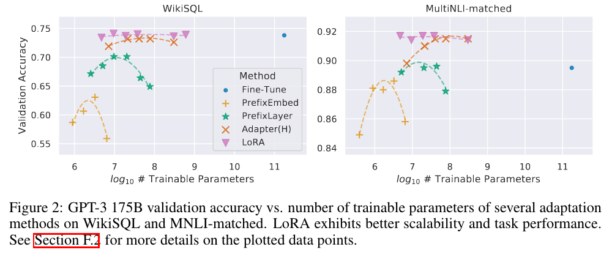

## tl;dr

## Context

## Done

## Learned

## Next?

## Log
- Try 8bit lora training with flan-t5 series.
  - large, 2m32s, 3.31g cuda memory during training, single card, adaptor size 19mb
  - xl, 3m32s, 6.91g, 37.9mb
  - xxl, 7m52s, 20g, 75.6mb
  - It's amazing that I could adapt a t5 xxl model with 1 card.
- 8bit inference of that lora model didn't work.
  ```python
    /usr/local/lib/python3.8/dist-packages/bitsandbytes/functional.py:1698 in transform              │
  │                                                                                                  │
  │   1695                                                                                           │
  │   1696                                                                                           │
  │   1697 def transform(A, to_order, from_order='row', out=None, transpose=False, state=None, ld=N  │
  │ ❱ 1698 │   prev_device = pre_call(A.device)                                                      │
  │   1699 │   if state is None: state = (A.shape, from_order)                                       │
  │   1700 │   else: from_order = state[1]                                                           │
  │   1701 │   if out is None: out, new_state = get_transform_buffer(state[0], A.dtype, A.device, t  │
  ╰──────────────────────────────────────────────────────────────────────────────────────────────────╯
  AttributeError: 'NoneType' object has no attribute 'device'
  ```
- `os.environ["CUDA_VISIBLE_DEVICES"] = "0"` is ignored in 8bit inference.  
- Can't even get single card, `load_in_8bit` work as expected. Feel like fighting the framework. The api is not clear and waste time try and error to get the framework to behave as expected. It should be more controllable to deal with `mixed precision` training, `int8` inference and `PEFT`. Very frustrated.
- [FileGithubIssue(https://github.com/huggingface/peft/issues/115)]
- Turns out, as always. Part of my stupidity and part of something I don't know. Need to learn more about `int8` inference and its HF integration.
- Bump into [Mosaic's fp8 support](https://github.com/mosaicml/composer/pull/1965). Would get a 4090 if fp8 or bf8 is possible. 
- [Read([LoRA](https://arxiv.org/abs/2106.09685))]
  - I like it didn't use context window, and the LoRA modules could be fused to host model with no extra inference cost.
  - With increasing r, LoRA is approximating the full finetuning. 
  - Very clever and efficient way to change the model. 
  - In theory, prompt tuning can't match LoRA's performance? Why did `MedPaLM` choose prompt tuning? To avoid overfitting and keep Flan-PaLM's generality? 
  - 
    - I feel, for small model, one could just give up prompt tuning. Should go straight to LoRA. Just have to sacrifice generality for targeted performance. 
    - Plus you don't want to hyperparam search n for max prompt tuning performance, per task? LoRA is more parameter tolerant, at least from what is shown in the paper. 
    - Adaptor is more for modality fusion. 
  - Apply to `[q, v]`, `r=8` is good starting point. The update matrix ∆W could have a very small “intrinsic rank”. Chasing large r is waste of resource. 
- [Read([P-tuning v2](http://arxiv.org/abs/2110.07602))]