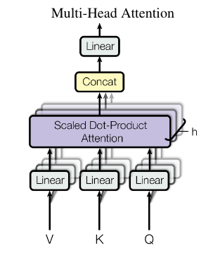
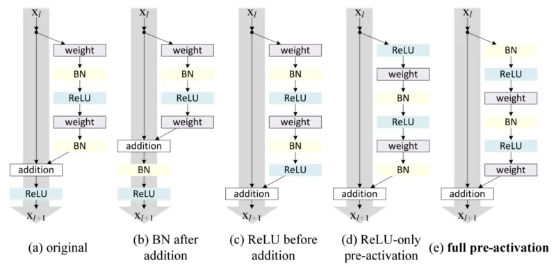
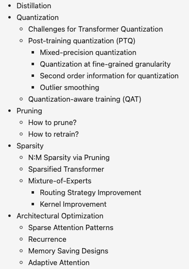

## tl;dr

## Context
- To go beyond HF trainer and start building multimodal adapters, I need low level model surgery skills.

## Done

## Learned

## Next?

## Log
- [blog -> https://lukaemon.github.io/posts/2023/from-text-to-multimodal/]
- Watching video: https://www.youtube.com/watch?v=kCc8FmEb1nY
- `matmul` is super versatile. Multiplication and a sum can really express so many things and it's parallelization. 
- If one chooses the right (NN, data, objective) combo, semantics and tasks could be reduced to +-*/ of vectors in that latent space. `matmul` can express +-*/ of vectors in batch and the operation is parallelizable on current hardware. 
- Just realize optimizer won't give you new capability. Lion, @chenSymbolicDiscoveryOptimization2023, cooks faster but the result should be the same. 
    - Not the same actually. With the same computation budget, lion could take you further. 
    - The same actually lol. The result would still be in the same league of (NN, data, objective) combo.
- Dig deeper about `mask`. It's more interesting than what I knew before.
    ```python
    tril = torch.tril(torch.ones(T, T))
    wei = torch.zeros((T,T))
    wei = wei.masked_fill(tril == 0, float('-inf'))
    wei = F.softmax(wei, dim=-1)

    x = wei @ x
    ```
    - Think of sequence of tokens as time series. dim=0 of tril is autoregressive mask. 
    - Initial wei number is irrelevant. Equal number means simple average.
    - `masked_fill`, the `-inf` is like introducing a wall so that tokens can't see the future. 
    - `F.softmax` to create weights. Absolute number would be normalized and sums to 1. 
    - `wei @ x` compute weighted average. Still a full matmul given the sparse mask. Mask didn't save any flop and padding would increase flop. 
- `self-attention` is context aware weighted average. Crazy that modern AI is multi-layer smart weighted average plus simple FFN. 
- FFN is 80% computation in PaLM. I don't know how attention free transformer research is relevant. The formula of vanilla transformer is weighted average plus FFN for non-linear transformation and repeat. 
- AK describes self-attention as `data dependent`. Yes. I want `mid fusion bottleneck` to be `data independent` as well. 
- Linear transformation to map x -> qkv is interesting. 
- 
    - Learnable token embedding -> linear -> mha -> linear: attention doesn't have non-linear transformation. 
    - The only non-linear transformation is in the FFN. d_model -> d_ff -> GELU -> d_model. `d_ff = 4 * d_model`, latent dim expansion. Bigger space for rotation and squashing.
    - Multi-head attention is like doing attention with `h` perspectives. Also `d_k = d_model / h`, which is a kind of information bottleneck. For each head, pay attention to some aspect of the input, then `concat` later.
- Just realize how signal rich of `next token prediction` objective with autoregressive decoder. 
    - `[0, 1, 2, 3], 4, 5, 6, ,7 ,8, ....` endless stream of language tokens
    ```python
    context_window=4
    idx = [0, 1, 2, 3]
    target = [1, 2, 3, 4]

    # meaning 0 -> 1
    # 0, 1 -> 2
    # 0, 1, 2 -> 3
    # 0, 1, 2, 3 -> 4
    
    logits = transformer(idx)  # (4, vocab_size)
    loss = F.cross_entropy(logits, target)
    ``` 
    - The loss contains all autoregressive next token prediction for every single token in the context window.
    - Compare this to RL, after so many actions you get one reward. Transformer is apparently way more signal rich.
    - Compare this to masked language modeling, you get signal from masked tokens only. 
    - Similar idea applies to diffusion model. Every step of diffusion provides targets for every reverse U-Net denoising step in the latent space. L2 loss has the same effect as MLE. 
    - In text's next token prediction, optimize for MLE = minimize NLL, which has the same effect as minimize KL divergence between the model and the data, which has the same effect as minimize cross entropy. 
    - In regression, take latent diffusion for example, minimize L2 loss has the same effect as optimize for MLE under the assumption of Gaussian noise.
- Compare and contrast ChatGPT and BingChat discussion. 
    - [ChatGPT -> [asset/chatgpt_mle.png](asset/chatgpt_mle.png)], [BingChat -> [asset/bingchat_mle.png](asset/bingchat_mle.png)]
    - The pros and cons of conditioning LM output on retrieval is an ongoing experiment. 
    - Hallucination of pure in-param LM is real but it could generate answer more freely, more creatively because it could traverse latent space with less limitation. 
    - Retrieval LM bootstrap trust from citation, that is cheapest trust. It is not absolute win because the result would be limited to what bing index have on what human has written. Bing is not the ultimate arbiter of truth, nor did human has better performance of reporting truth.
    - ChatGPT is more suitable for open discussion. BingChat is more like a fancy wikipedia chatbot. I think the power and impact of ChatGPT is greater. The value of AI is introducing new perspectives, like AlphaGO to the game of GO, not reinforcing existing human echo chamber. What a boring AI AlphaGO becomes if we RLHF it to human's GO style? RLHF, or general HF are smart PR.
    - This is calibration problem as well. If the agent could know whether the search is necessary, it would generate better answer.
- You see this is interesting that with learnable embedding and the linear transform x to qkv, the back propagation is optimizing representation learning on top of the ever changing embedding. 
    - Counter intuitive to how human works. Usually we change one variable at a time and prefer a fix point as the foundation. 
    - Learnable embedding plus billions of transformer parameters are crazy moving targets to optimize by one simple objective. I wonder whether position encoding is necessary at pretraining.
        - Both `LLaMA` and `PaLM` use `RoPE`, rotary position encoding.
    - The general, super vague next token prediction objective is the key. 
    - I think it has to be that vague and general for such dynamic system to work. Say image net classification, the objective is too specific so that the system would be myopic, aka won't generalize well to new data.
- Scale weight with $1/\sqrt{d_k}$ to keep the variance of weight close to 1, which prevent softmax op to turn weight into one hot vector.
- Multihead attention as different, independent communication channels. Each channel could specialize to different topic that tokens want to talk about, and the final concat would bring all discussions together. 
    - `PaLM 540b` has 48 heads. `d_head` = 18432 / 48 = 384. 
    - `LLaMA 65b` has 64 heads. `d_head` = 8192 / 64. 
- AK describes `MHA` as tokens communicate with each other, and the following `FFN` as thinking about it, per token level. Love it! `FFN` is where non-linearity is applied. Without non-linearity, the whole transformer stack is just one big linear transformation. 
    - This image of each token as one agent. First they talk to each other via `MHA`, then think about it independently via `FFN` is so vivid. 
    - Think about 16*16 image patches. That's 256 tokens, not crazy. Even 32*32 is within modern transformers' context window. What should be the `positional encoding` for ViT? `Polar coordinate system`, as 2d extension to `RoPE`. 
    - @dosovitskiyImageWorth16x162021
        > Position embeddings are added to the patch embeddings to retain positional information. We use standard learnable 1D position embeddings, since we have not observed significant performance gains from using more advanced 2D-aware position embeddings
    - Raster order is enough. OMG. 
- Intersperse communication with computation.
- 3 basic techniques to improve training stability of scaled model:
    1. `Residual connection` as gradient super highway all the way back to input. Learnable embedding and every param along the way needs that. 
        - 
        - Love this illustration. Think about communication as forks that being merged along the residual super highway. 
        - Since I just learned vector addition is so powerful, @pfeifferModularDeepLearning2023, these forks along the way are actually distilling some info and merge them back to all the way to input embeddings. Literally as functional pipeline for information precessing. 
        - [lesson_learned -> visualize the gradient flow. Do you see blocks, dead loop or any weird circulation? Gradient is like blood, you want every part of the model has healthy blood circulation.]
    2. `LayerNorm`, per row to make it unit Gaussian. 
    3. `Dropout` before the merging the fork back to residual pathway. 
        - End of FFN
        - End of MHA
        - End of softmax before @v
            - Interesting. Like lossy communication among tokens, meaning for a token x, some % of previous tokens are not reachable. Token has to learn to contribute with imperfect information.
        - A form of information bottleneck to alleviate overfitting. 
- End-dec is like for each decoder layer, add the input representation to the decoding computation path. Kind of super reinforcing, or CONDITION, the decoding computation wrt input text. Of course it's not necessary in so many ways:
    - Do we have to merge input info for each decoder block? Where is the best position to merge? Remember this 2017. In-context learning and few shot learning were not a thing yet.
    - Translate `input text` to french -> `first_token`
    - As you can see in this in-context one shot translation, the generation of `first_token` could actually consider all previous tokens, including all instruction and input text tokens. That makes bidirectional encoder stack totally redundant. And that stack can't contribute to token generation directly.
    - Meaning we are manually forcing functional separation. One stack for input text representation learning. One stack for text generation. And cross attention to every decoder layer is how input info gets to condition output generation. That architecture feels good because it's mentally ordered and controllable. But would definitely performs worse. It's against `bitter lesson`.
    - All manual engineering above are sub-optimal wrt hyperscale. One simple giant decoder stack with big good data could optimize all of those decisions automatically, and achieve many more that you don't even know to look for.
    - Shift the worries. Instead of engineering functional compositions, worry about data quantity, quality, training efficiency, cluster management and so on. 
    - [lesson_learned -> `mid fusion bottleneck` feels so right. Now find a way to make it data dependent instead of manually deciding when to fuse and how many bottleneck tokens it should have.]
- Larger code book, condensed tokens vs small code book, ex: char level, lengthy tokens. Interesting trade off that I'm pretty sure it has trivial information theory support but I don't know. Both feeling good and sad to this known unknown...
    - When in doubt, ask [ChatGPT]
        > The trade-off between using a large code book with condensed tokens and a small code book with lengthy tokens is related to information theory, specifically the concepts of entropy and compression.
        >
        > Entropy is a measure of the uncertainty or randomness in a message or data. In the context of language modeling, entropy refers to the amount of information contained in a sequence of words or characters. A sequence with high entropy contains more unpredictable or varied information, while a sequence with low entropy contains more predictable or repetitive information.
        >
        > Compression, on the other hand, is the process of reducing the size of a message or data while preserving its content. Compression is typically achieved by identifying patterns or redundancies in the data and using a more efficient encoding scheme to represent them.
        >
        > When it comes to language modeling, using a large code book with condensed tokens can reduce the entropy of a sequence by capturing more complex patterns and relationships between words or characters. This can lead to more accurate predictions and better performance in tasks such as text generation or language translation. However, using a large code book can also increase the complexity and computational cost of the model.
        >
        > On the other hand, using a small code book with lengthy tokens (such as at the character level) can simplify the model and reduce its computational cost. However, this can also increase the entropy of the sequence and lead to less accurate predictions, particularly for more complex or unpredictable sequences.
        > 
        > Overall, the choice of code book and tokenization strategy in language modeling involves a trade-off between accuracy and efficiency, which is informed by the principles of entropy and compression in information theory.
    - $20/month. Worth it.
    - Then I ask `ChatGPT` to find logical or factual error on itss previous answer
      > The statement "using a large code book with condensed tokens can reduce the entropy of a sequence" is not entirely accurate. While a large code book can capture more complex patterns and relationships, it doesn't necessarily reduce the entropy of the sequence. Rather, it can increase the model's ability to capture and represent the entropy of the sequence, leading to more accurate predictions.
    - Make sense to me. I think in the future, for factual QA, I need to cross reference ChatGPT with BingChat and decide whether the answer is good enough or I need to manually dig deeper. 
- Large model's sample efficiency applies to not only pretraining, but also finetuning. That's why the same instruction finetuning dataset would work better on LLM than 11b. 
- When it's time to worry about inference practicality, these tricks kick in, @wengLargeTransformerModel2023 
    - [lesson_learned -> reaffirms that it's waste of time AND resource to start and only work on small 11b model. Doing that would not get you to `Pareto frontier` of any computation budget caste. You have to figure out a way to amortize LLM training to minimize total ownership cost of modern AI.]
- [code(bigram as baseline) -> [bigram.py](bigram.py)]
- [code(naive chargpt) -> [chargpt.py](chargpt.py)]