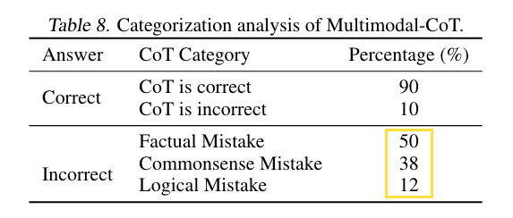

## Done

## Learned
### Pseudo code
```python
# given text and image input
rationale = fn(x_text, x_vis)
answer = fn(x_text + rationale, x_vis)


def fn(x_lang, x_vis):
    """encoder decoder transformer
    x_lang: text input, (n), len of text input 
    x_vis: image input, preprocessed by DETR, (m), m patch
    """
    h_lang = encoder(x_lang)  # (n, d), d, hidden dimension

    # manually designed text-image modality fusion
    h_vis = W_h @ x_vis  # (m, d)
    h_attn_vis = softmax(h_lang @ h_vis.T / math.sqrt(h_lang.shape[-1])) @ h_vis  # (n, d)
    r = sigmoid(W_l @ h_lang + W_v @ h_attn_vis)
    h_fuss = (1 - r) * h_lang + r * h_att_vis

    # generate text output autoregressively
    y = decoder(h_fuss) # (o), len of text output
    return y
```
- 2 enc-dec pass per QA. The first is to get rationale. The second is to get answer.
- The glue architecture here is cross attention plus gated fusion, introducing 3 more matrices, W_l, W_v, W_h.
- 2 stage finetuning matches 2 enc-dec pass per QA. Contribution: new rationale engineering formula.
  - Previous few shot or zero shot CoT are 1 pass generation for both rationale and answer with decoder transformer. 
  - 2 pass approach with end-dec, a form of sparsity, helps better condition the decoder with `h_fuss` to achieve better generation? 
  - What does 2 stage finetuning really mean? Divide and conquer in the training phase? Like CoT makes output auditable, 2 stage finetuning makes training explainable?

### A lot of manual engineering
1. One matmul to enter `x_vis` into hidden space. 
2. The whole process of modality fusion.
3. 2 pass answer generation. 

Could these all be replaced by doing few-shot with `Flamingo`, and `instruction prompt tuning` to make it zero shot? 

That said, `gated cross attention` in `Flamingo` is designed as well. Modality fusion is open question. The beauty of this paper is simple and easy engineering to get multimodal QA working better.

### Multimodal vector space
- `DETR` is the major effort to get mutual information of image and text. `h_vis` will go through non-linearity in fusion and decoding phase plus all param finetuning would definitely adopt. 
- `T5`'s hidden space is language dominant by design. Use caption or `DETR` are actually good hack to avoid dealing with creating a vector space that both image and text are first class citizen. 
- Maybe `DETR` keep more info than caption, or extract more useful info for this ScienceQA task. Compares to raw info reserve in pixel space, how to adjust the level of info and what info to extract for downstream task. The goal is definitely to find a learnable approach. 
- The journey to ground an image to text hidden space is too manual here. May become a bottleneck to future development? 
- For the purpose of creating native multimodal vector space, I do see the value of Yann's agenda to promote joint embedding predictive architecture, `JEPA`, and the warning of maximum likelihood method. The warning is extremely harsh and uncomfortable under current context of Sparrow, ChatGPT, Claude, Bard and Bing, but true. 

### Error analysis

- Factual mistake could be solved by retrieval augmentation.
- Common sense and logical mistake could be solved by scale. Can't afford that route. How to do better in <3b regime?  

## Possibility
Stay within <3b:
- Naive scale. Change base model to 3b. See if common sense and logical mistake are improved.
- Help LM to make better informed decision and push the multistage finetuning a little bit:
  - It could be 4 stages:
    1. finetune enc-dec to generate detailed description of the image from detr feature set, conditioned on the question: `fn(image, question): image description`
    2. finetune open web n_top search retrieval summary: `fn(question, image description): retrieval_summary`
    3. finetune `fn(question, image description, retrieval_summary): rationale`
    4. finetune `fn(question, image description, retrieval_summary, rationale): answer`
  - Use LM to fill in blanks to compensate info loss from pixel to text. 
  - Conditioned on the question. The same why read the question and options first in reading comprehension test before reading the passages could boost the performances. Priming the brain with goals to efficiently spot useful info.
  - Maybe further condition image description with caption, anchor the image to reduce hallucination.
  - I don't know if this recursive finetuning is a good idea, or they actually could be done in parallel, or they are meaningless fight within <3b regime. Decoder generation is already recursive. `LaMDA` and `Sparrow` had learned to do web search. Incorporate CoT and image features are just expected incremental improvement. 
- Better fusion mechanism? 
